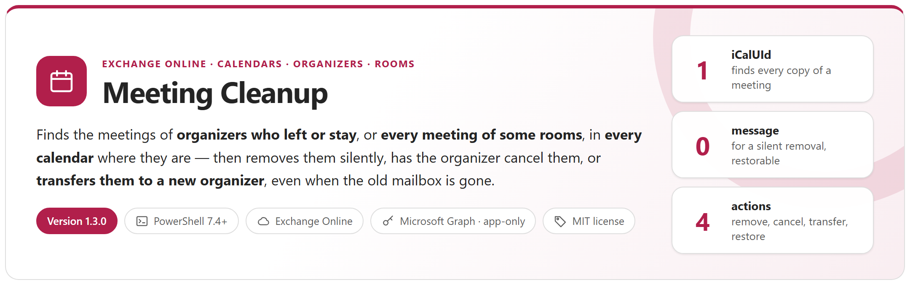
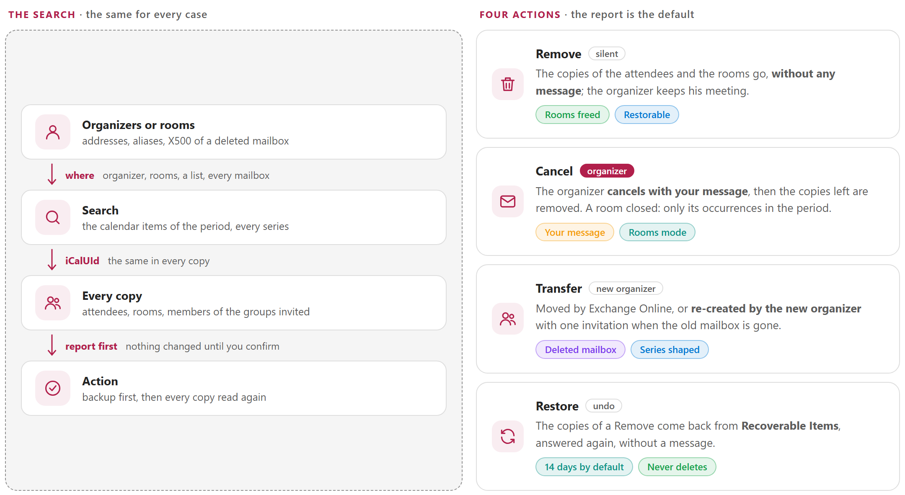
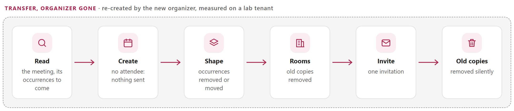
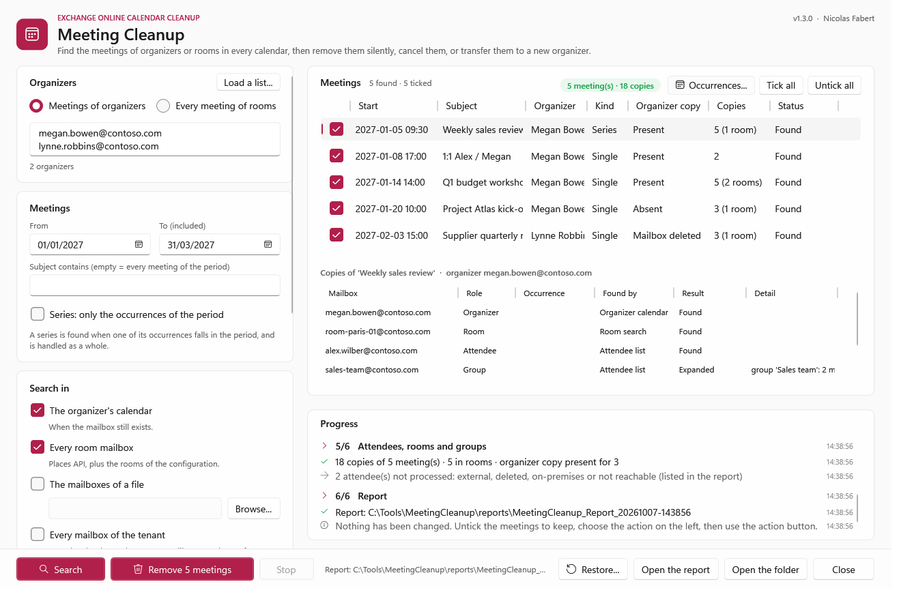
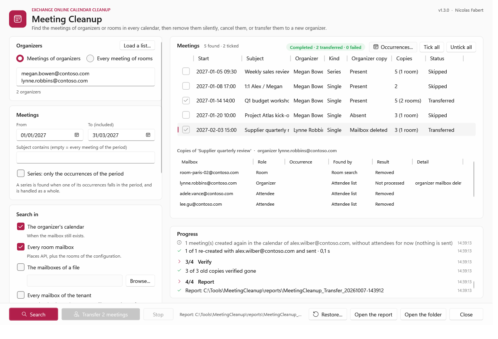
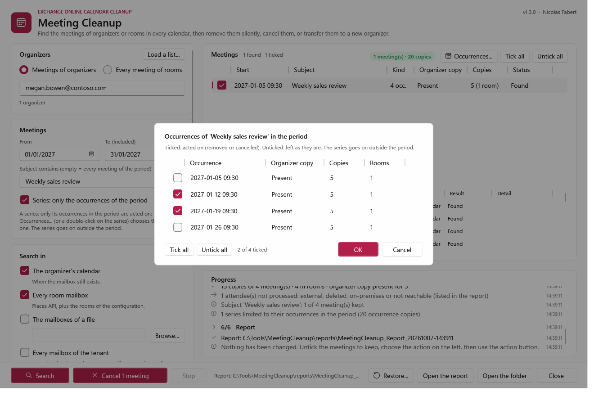
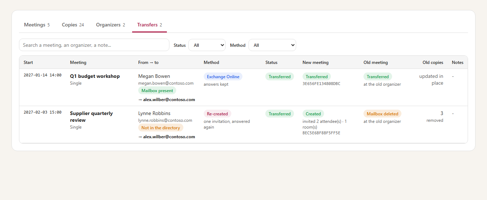
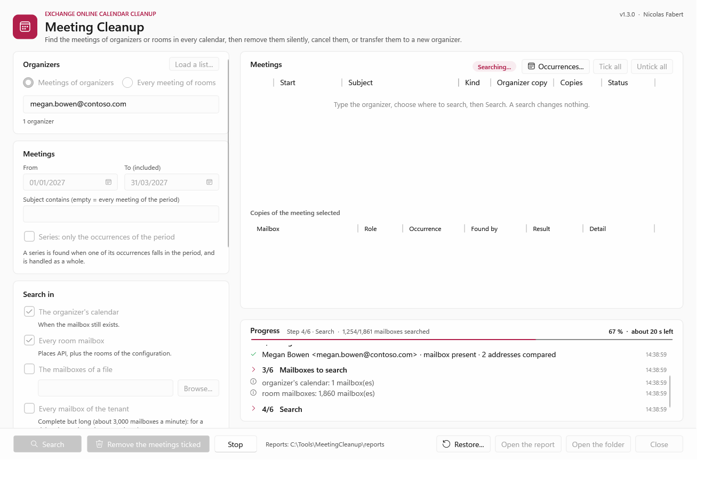

<p align="center">
  <picture>
    <source media="(prefers-color-scheme: dark)" srcset="package/docs/images/readme-banner-dark.png">
    
  </picture>
</p>

<p align="center">
  <a href="#how-it-works"><b>How it works</b></a> &nbsp;&middot;&nbsp;
  <a href="#the-actions"><b>The actions</b></a> &nbsp;&middot;&nbsp;
  <a href="#transfer-to-a-new-organizer"><b>Transfer</b></a> &nbsp;&middot;&nbsp;
  <a href="#reports"><b>Reports</b></a> &nbsp;&middot;&nbsp;
  <a href="#quick-start"><b>Quick start</b></a> &nbsp;&middot;&nbsp;
  <a href="package/docs/MeetingCleanup-UserGuide.md"><b>User guide</b></a> &nbsp;&middot;&nbsp;
  <a href="package/docs/MeetingCleanup-Guide.md"><b>Developer guide</b></a>
</p>

> [!IMPORTANT]
> Files downloaded from the Internet may be blocked by Windows and fail to run. Before using this project, unblock every file in the downloaded folder:
>
> ```powershell
> Get-ChildItem "C:\Chemin\Du\Dossier" -Recurse -File -Force | Unblock-File
> ```
>
> Replace the example path with the folder where you downloaded or extracted this project.

## Why

Meetings outlive the people and the decisions behind them. A person leaves and their weekly meetings keep booking the rooms; an organizer deletes a meeting without sending the cancellation and it stays in every attendee's calendar; a mailbox is deleted and its meetings can no longer be cancelled by anyone; a room closes for two weeks of works and every meeting booked in it must go. In each case the meeting exists in **many mailboxes** — the organizer, the rooms, the attendees, the members of the groups invited — and each copy has to be found and handled.

This tool does it for **Exchange Online** with one search for every case, a report first, then a clear choice: remove the copies **silently**, have the organizer **cancel** the meetings, or **transfer** them to a new organizer. A silent removal can be **restored**.

<picture>
  <source media="(prefers-color-scheme: dark)" srcset="package/docs/images/readme-principles-dark.png">
  
</picture>

## How it works

<picture>
  <source media="(prefers-color-scheme: dark)" srcset="package/docs/images/readme-how-it-works-dark.png">
  
</picture>

- **Every copy, wherever the meeting is found**: one copy of a meeting holds its whole attendee list. Every internal attendee, room and member of an invited group is then asked for its own copy, by **iCalUId** (the same in every copy). External or deleted attendees are listed, not processed.
- **Organizer present or gone**: its calendar when the mailbox exists; the rooms, a list of mailboxes or every mailbox of the tenant when it does not — from the old address or the X500 address of the deleted mailbox. A list of organizers is searched in one pass.
- **Rooms over a period** (`-Room`, `-RoomFile`): every meeting of the rooms, whatever its organizer. A series is limited to the occurrences the rooms hold in the period; it goes on before and after.
- **One occurrence of a series** (`-SeriesScope Occurrences`, or *Series: only the occurrences of the period* in the window): a series is limited to its occurrences in the period — one day, one occurrence — for everyone (*Cancel*) or silently (*Remove*). In the window, **Occurrences...** ticks the ones to act on; the series goes on.
- **Nothing by surprise**: the report is the default action. Every action shows exactly what it will do and asks to type **YES**; a backup (`Backup.json`) is written before any change; each copy removed is read again to check it is gone. `-FromReport` acts on exactly the meetings of a reviewed report.
- **Large tenants**: `$batch` requests of Microsoft Graph, 16 in flight; the window runs every search and action in the background and keeps answering, with a progress bar and the time left — about 6,000 mailboxes read in a minute and a half in the lab.
- **Application permissions of Microsoft Graph** and a certificate: no user account, no module for the search, Remove, Cancel and a re-creation.

## The actions

Measured on a lab tenant ([developer guide, chapter 4](package/docs/MeetingCleanup-Guide.md#4-the-actions) and appendix C):

| Action | Organizer's meeting | Attendees and rooms | Messages |
|---|---|---|---|
| **Report** (default) | — | — | none: nothing is changed |
| **Remove** | left as it is (removing it there **always** sends a cancellation) | copies removed | **none** |
| **Cancel** | cancelled with your message, rooms released | copies left removed | the cancellation |
| **Transfer** (`-NewOrganizer`) | moved by Exchange Online, or re-created by the new organizer | updated silently, or one new invitation; the old copies removed silently | none, or the invitation of the new organizer |
| **Restore** (`-FromReport` of a Remove run) | — | copies put back from Recoverable Items, answered again: rooms busy again | **none** |

A removed copy stays restorable for the retention of deleted items (14 days by default). A cancellation cannot be undone: the attendees received it.

## Transfer to a new organizer

`-Action Transfer -NewOrganizer <address>` gives the meetings found to another person. Two ways, chosen for each meeting (`-TransferMethod Auto`, the default):

- **The old organizer is still active**: Exchange Online moves the meeting (`Invoke-ChangeMeetingOrganizer`); the attendees of the organization are updated silently. It needs Exchange Online PowerShell and a role of its own ([developer guide, chapter 5](package/docs/MeetingCleanup-Guide.md#rights-for-transfer)).
- **The old mailbox is gone** — deleted, or soft-deleted after the user was removed: no one can cancel or move the meeting any more. The tool **re-creates it in the new organizer's calendar**:

<picture>
  <source media="(prefers-color-scheme: dark)" srcset="package/docs/images/readme-transfer-dark.png">
  
</picture>

- A series is re-created **from now**, in its own time zone, with its occurrences removed or moved; every occurrence to come must find its slot in the new series, otherwise the meeting is not transferred.
- A failure before the invitation removes the new meeting: nothing has been sent, and the old room copies already removed can be restored.
- The attendees answer the new invitation; a Teams link is created again by the new organizer.
- The report of a transfer opens on its **Transfers** tab: for each meeting, from whom to whom, how (Exchange Online or re-created), the new meeting and its invitation, what became of the old meeting and of its copies (`MeetingCleanup-Transfers.csv` too).

## Reports

<table>
  <tr>
    <td width="50%" valign="top"><a href="package/docs/images/report-overview.png"></a><br><sub><b>HTML report</b> &middot; who was searched, where, every meeting and every copy with the answer of Microsoft Graph</sub></td>
    <td width="50%" valign="top"><a href="package/docs/images/gui-search-light.png"></a><br><sub><b>Window</b> &middot; organizers or a list, the period, where to search; untick the meetings to keep, then the action</sub></td>
  </tr>
  <tr>
    <td width="50%" valign="top"><a href="package/docs/images/gui-rooms-light.png"></a><br><sub><b>Rooms over a period</b> &middot; every organizer; a series shows its occurrences in the period, the only ones acted on</sub></td>
    <td width="50%" valign="top"><a href="package/docs/images/gui-transfer-light.png"></a><br><sub><b>Transfer</b> &middot; one meeting moved by Exchange Online, one re-created for a deleted organizer</sub></td>
  </tr>
</table>

<details>
<summary><b>Occurrences of a series</b> &middot; the Mondays of the period, only the ones ticked are cancelled or removed</summary>
<br>
<a href="package/docs/images/gui-occurrences-light.png"></a>
</details>

<details>
<summary><b>Transfers tab</b> &middot; after a transfer: from whom to whom, how, the new meeting, the old one and its copies</summary>
<br>
<a href="package/docs/images/report-transfers.png"></a>
</details>

<details>
<summary><b>A search in progress</b> &middot; the step, the part done and the time left; the window keeps answering</summary>
<br>
<a href="package/docs/images/gui-progress-light.png"></a>
</details>

Each run writes `MeetingCleanup-Meetings.csv`, `-Copies.csv`, `-Organizers.csv` (and `-Transfers.csv` after a transfer), `-Summary.json`, `-Backup.json` (written before any change) and a self-contained HTML report, in a folder of its own.

## Requirements

| Item | Requirement |
|---|---|
| Exchange | **Exchange Online** only |
| PowerShell | 7.4 or later — a portable zip is enough; 7.5 or later for the Windows 11 look of the window |
| Windows | Windows 10 / 11 or Windows Server 2016 to 2025; the window needs a desktop session, the command line runs anywhere (scheduled task) |
| Application | An application registered in Microsoft Entra with the **application** permissions `Calendars.ReadWrite` (or `Calendars.ReadWrite.All`), `User.Read.All`, `Place.Read.All` and `GroupMember.Read.All` (admin consent), and a **certificate** whose private key is in the Windows store of the account that runs the tool ([developer guide, chapter 5](package/docs/MeetingCleanup-Guide.md#5-application)) |
| Account | No Exchange or Entra role to run it: the application signs in |
| *Restore* | Module `ExchangeOnlineManagement` 3.2+ and the role **Mailbox Import Export** for the application (`Exchange.ManageAsApp`) or an administrator |
| Native *Transfer* | The same module and a role limited to `Invoke-ChangeMeetingOrganizer`; a re-creation needs nothing more |
| Network | HTTPS to `login.microsoftonline.com` and `graph.microsoft.com`; `outlook.office365.com` for *Restore* and a native *Transfer* |

## Quick start

Download `MeetingCleanup-<version>.zip` from the [latest release](https://github.com/Nico77600/MeetingCleanup/releases/latest), extract it (for example in `C:\Tools`) and unblock the files (command at the top of this page). You can also copy the repository `package` folder.

```powershell
cd C:\Tools\MeetingCleanup-1.3.0
notepad .\config\MeetingCleanup.config.psd1          # tenant, application, certificate thumbprint

.\Invoke-MeetingCleanup.ps1 -Gui                     # the window: search, untick, act, restore

# Or the command line: always a report first (nothing is changed), then the same command with the action
.\Invoke-MeetingCleanup.ps1 -Organizer megan.bowen@contoso.com
.\Invoke-MeetingCleanup.ps1 -Organizer megan.bowen@contoso.com -Action Cancel -Comment 'Megan has left the company.'
.\Invoke-MeetingCleanup.ps1 -Organizer john.doe@contoso.com -SearchIn Rooms, AllMailboxes -Action Transfer -NewOrganizer jane.roe@contoso.com
.\Invoke-MeetingCleanup.ps1 -Room room-paris-01@contoso.com -Start 2026-11-02 -End 2026-11-13 -Action Cancel -Comment 'Closed for works.'
.\Invoke-MeetingCleanup.ps1 -Organizer megan.bowen@contoso.com -Subject 'Weekly sales review' -SeriesScope Occurrences -Start 2026-11-16 -End 2026-11-16 -Action Cancel -Comment 'Not this Monday.'
.\Invoke-MeetingCleanup.ps1 -Action Restore -FromReport .\reports\MeetingCleanup_Remove_20261105-093000
```

One command per everyday question — who still organizes what, a leaver with or without mailbox, a transfer, one series, one occurrence of a series, rooms closed, the leavers of the month, undo a removal: see the [user guide](package/docs/MeetingCleanup-UserGuide.md).

The `package` folder of this repository holds exactly the files needed to run, with the guides. The zip of each [release](https://github.com/Nico77600/MeetingCleanup/releases) contains the same run-time files with the HTML guides; `.\tools\New-MeetingCleanupPackage.ps1` builds that zip content from the repository.

## Documentation

| Guide | Content |
|---|---|
| **[User guide](package/docs/MeetingCleanup-UserGuide.md)** | For the people who run the tool: **prerequisites**, the one-time setup and **everyday commands only** — which meetings this person still organizes, a person has left (mailbox kept or deleted), give the meetings to someone else, one series without a message, rooms closed for works, the leavers of the month, undo a removal, the window, the results. |
| **[Developer guide](package/docs/MeetingCleanup-Guide.md)** | Everything else: how it works, every case, each action as measured on a lab tenant (Remove, Cancel, rooms mode, Transfer, Restore), the application and the Exchange Online roles, every setting and parameter, the window, the report, the files produced, the architecture, performance and limits, tests, troubleshooting, security. |

Both guides also exist as a single HTML file with a light and a dark theme (`package/docs/MeetingCleanup-UserGuide.html`, `package/docs/MeetingCleanup-Guide.html`): download them and open them locally, or use the copies in the release zip.

## Tests

```powershell
.\Run-Tests.ps1                                  # Pester 6.1+, a simulated Exchange Online tenant, no network
pwsh -STA -File .\tools\Measure-MeetingCleanup.ps1 -Meetings 600 -Search -Gui   # time of each step, synthetic data
```

The tool was also validated on a lab tenant (about 6,000 mailboxes, 1,860 rooms): organizers present, soft-deleted and deleted, lists of organizers, Remove and Restore without any message, Cancel, rooms over a period with series, one occurrence of a series cancelled or chosen in the window, transfers moved by Exchange Online and re-created for a deleted mailbox ([developer guide, appendix C](package/docs/MeetingCleanup-Guide.md#appendix-c---lab-measurements)).

## License

[MIT](LICENSE).

## Disclaimer

Personal project, provided as is. It is not an official Microsoft product and is not supported by Microsoft. Removing, cancelling or transferring meetings changes real calendars: always start with a report, and test it in your environment before production use.
