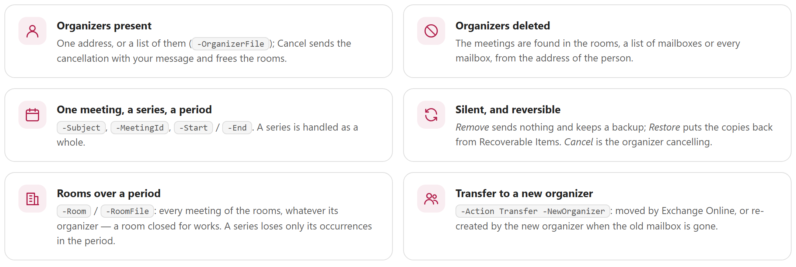
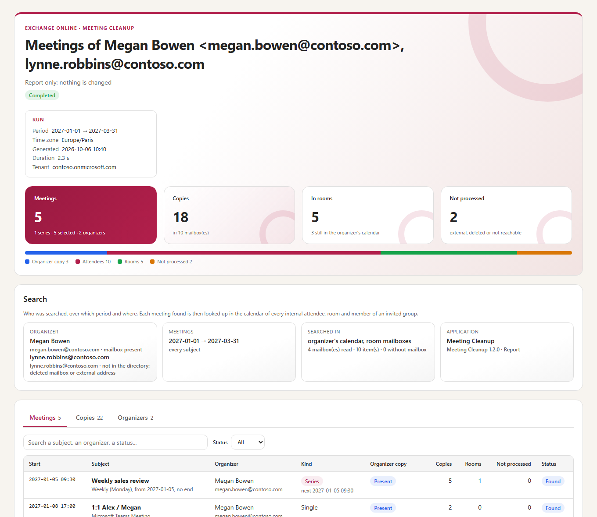
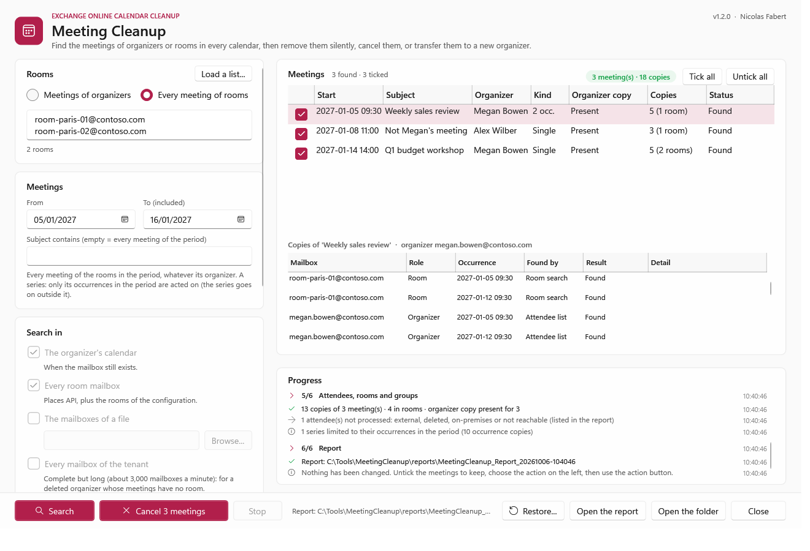

<p align="center">
  <picture>
    <source media="(prefers-color-scheme: dark)" srcset="docs/images/readme-banner-dark.png">
    
  </picture>
</p>

<p align="center">
  <a href="#why"><b>Why</b></a> &nbsp;&middot;&nbsp;
  <a href="#how-it-works"><b>How it works</b></a> &nbsp;&middot;&nbsp;
  <a href="#the-actions"><b>The actions</b></a> &nbsp;&middot;&nbsp;
  <a href="#transfer-to-a-new-organizer"><b>Transfer</b></a> &nbsp;&middot;&nbsp;
  <a href="#reports"><b>Reports</b></a> &nbsp;&middot;&nbsp;
  <a href="#user-guide"><b>User guide</b></a> &nbsp;&middot;&nbsp;
  <a href="#detailed-guide"><b>Detailed guide</b></a>
</p>

> [!IMPORTANT]
> Files downloaded from the Internet may be blocked by Windows and fail to run. Before using this project, unblock every file in the downloaded folder:
>
> ```powershell
> Get-ChildItem "C:\Chemin\Du\Dossier" -Recurse -File -Force | Unblock-File
> ```
>
> Replace the example path with the folder where you downloaded or extracted this project.

## Why

Meetings outlive the people and the decisions behind them. A person leaves and their weekly meetings keep booking the rooms; an organizer deletes a meeting without sending the cancellation and it stays in every attendee's calendar; a mailbox is deleted and its meetings can no longer be cancelled by anyone; a room closes for two weeks of works and every meeting booked in it must go. In each case the meeting exists in **many mailboxes** — the organizer, the rooms, the attendees, the members of the groups invited — and each copy has to be found and handled.

This tool does it for **Exchange Online** with one search for every case, a report first, then a clear choice: remove the copies **silently**, have the organizer **cancel** the meetings, or **transfer** them to a new organizer. A silent removal can be **restored**.

<picture>
  <source media="(prefers-color-scheme: dark)" srcset="docs/images/readme-principles-dark.png">
  
</picture>

## How it works

<picture>
  <source media="(prefers-color-scheme: dark)" srcset="docs/images/readme-how-it-works-dark.png">
  
</picture>

- **Every copy, wherever the meeting is found**: one copy of a meeting holds its whole attendee list. Every internal attendee, room and member of an invited group is then asked for its own copy, by **iCalUId** (the same in every copy). External or deleted attendees are listed, not processed.
- **Organizer present or gone**: its calendar when the mailbox exists; the rooms, a list of mailboxes or every mailbox of the tenant when it does not — from the old address or the X500 address of the deleted mailbox. A list of organizers is searched in one pass.
- **Rooms over a period** (`-Room`, `-RoomFile`): every meeting of the rooms, whatever its organizer. A series is limited to the occurrences the rooms hold in the period; it goes on before and after.
- **Nothing by surprise**: the report is the default action. Every action shows exactly what it will do and asks to type **YES**; a backup (`Backup.json`) is written before any change; each copy removed is read again to check it is gone. `-FromReport` acts on exactly the meetings of a reviewed report.
- **Application permissions of Microsoft Graph** and a certificate: no user account, no module for the search, Remove, Cancel and a re-creation.

## The actions

Measured on a lab tenant (detailed guide, chapter 4 and appendix C):

| Action | Organizer's meeting | Attendees and rooms | Messages |
|---|---|---|---|
| **Report** (default) | — | — | none: nothing is changed |
| **Remove** | left as it is (removing it there **always** sends a cancellation) | copies removed | **none** |
| **Cancel** | cancelled with your message, rooms released | copies left removed | the cancellation |
| **Transfer** (`-NewOrganizer`) | moved by Exchange Online, or re-created by the new organizer | updated silently, or one new invitation; the old copies removed silently | none, or the invitation of the new organizer |
| **Restore** (`-FromReport` of a Remove run) | — | copies put back from Recoverable Items, answered again: rooms busy again | **none** |

A removed copy stays restorable for the retention of deleted items (14 days by default). A cancellation cannot be undone: the attendees received it.

## Transfer to a new organizer

`-Action Transfer -NewOrganizer <address>` gives the meetings found to another person. Two ways, chosen for each meeting (`-TransferMethod Auto`, the default):

- **The old organizer is still active**: Exchange Online moves the meeting (`Invoke-ChangeMeetingOrganizer`); the attendees of the organization are updated silently. It needs Exchange Online PowerShell and a role of its own (detailed guide, chapter 5).
- **The old mailbox is gone** — deleted, or soft-deleted after the user was removed: no one can cancel or move the meeting any more. The tool **re-creates it in the new organizer's calendar**:

<picture>
  <source media="(prefers-color-scheme: dark)" srcset="docs/images/readme-transfer-dark.png">
  
</picture>

- A series is re-created **from now**, in its own time zone, with its occurrences removed or moved; every occurrence to come must find its slot in the new series, otherwise the meeting is not transferred.
- A failure before the invitation removes the new meeting: nothing has been sent, and the old room copies already removed can be restored.
- The attendees answer the new invitation; a Teams link is created again by the new organizer.

## Reports

<table>
  <tr>
    <td width="50%" valign="top"><a href="docs/images/report-overview.png"></a><br><sub><b>HTML report</b> &middot; who was searched, where, every meeting and every copy with the answer of Microsoft Graph</sub></td>
    <td width="50%" valign="top"><a href="docs/images/gui-search-light.png"></a><br><sub><b>Window</b> &middot; organizers or a list, the period, where to search; untick the meetings to keep, then the action</sub></td>
  </tr>
  <tr>
    <td width="50%" valign="top"><a href="docs/images/gui-rooms-light.png"></a><br><sub><b>Rooms over a period</b> &middot; every organizer; a series shows its occurrences in the period, the only ones acted on</sub></td>
    <td width="50%" valign="top"><a href="docs/images/gui-transfer-light.png"></a><br><sub><b>Transfer</b> &middot; one meeting moved by Exchange Online, one re-created for a deleted organizer</sub></td>
  </tr>
</table>

Each run writes `MeetingCleanup-Meetings.csv`, `-Copies.csv`, `-Organizers.csv`, `-Summary.json`, `-Backup.json` (written before any change) and a self-contained HTML report, in a folder of its own.

## User guide

What you need for daily use. The [detailed guide](#detailed-guide) goes further.

### 1. Prerequisites

| Item | Requirement |
|---|---|
| Workstation | Windows 10 / 11 or Windows Server 2016 to 2025, **PowerShell 7.4** or later (7.5 or later for the Windows 11 look of the window). |
| Application | An application registered in Microsoft Entra with the **application** permissions `Calendars.ReadWrite`, `User.Read.All`, `Place.Read.All` and `GroupMember.Read.All` (admin consent), and a **certificate** whose private key is in the Windows store of the account that runs the tool. |
| Network | HTTPS to `login.microsoftonline.com` and `graph.microsoft.com`; `outlook.office365.com` for *Restore* and a native *Transfer*. |
| *Restore* only | Module `ExchangeOnlineManagement` 3.2+ and the role **Mailbox Import Export** for the application (`Exchange.ManageAsApp`) or an administrator. |
| Native *Transfer* only | The same module and a role limited to `Invoke-ChangeMeetingOrganizer`. A re-creation needs nothing more. |

The commands to create the application, the certificate and the roles are in chapter 5 of the detailed guide.

### 2. Install

1. Download `MeetingCleanup-<version>.zip` from the [latest release](https://github.com/Nico77600/MeetingCleanup/releases/latest) and extract it, for example in `C:\Tools`.
2. Unblock the files (command at the top of this page).
3. Open `config\MeetingCleanup.config.psd1` in Notepad and fill in the tenant ID, the application ID and the thumbprint of the certificate.

### 3. Run

**The simplest: the window.**

```powershell
cd C:\Tools\MeetingCleanup-1.2.0
.\Invoke-MeetingCleanup.ps1 -Gui
```

Type the organizers (or load a list, or choose *Every meeting of rooms*), the period, then **Search**. Untick the meetings to keep, choose the action, then the action button: it shows what will happen and asks to confirm.

**From the command line** — always a report first, then the same command with the action:

```powershell
# What is there? Nothing is changed
.\Invoke-MeetingCleanup.ps1 -Organizer megan.bowen@contoso.com

# Megan has left but her mailbox is kept: she cancels her meetings, with a message
.\Invoke-MeetingCleanup.ps1 -Organizer megan.bowen@contoso.com -Action Cancel -Comment 'Megan has left the company.'

# John's mailbox is deleted: his meetings are found in the rooms and every mailbox, then removed silently
.\Invoke-MeetingCleanup.ps1 -Organizer john.doe@contoso.com -SearchIn Rooms, AllMailboxes -Action Remove

# The leavers of the month, one address per line
.\Invoke-MeetingCleanup.ps1 -OrganizerFile .\leavers.txt

# Two rooms closed for works: every meeting of the period cancelled by its organizer
.\Invoke-MeetingCleanup.ps1 -Room room-paris-01@contoso.com, room-paris-02@contoso.com -Start 2026-11-02 -End 2026-11-13 -Action Cancel -Comment 'Rooms closed for works.'

# Jane organizes John's meetings from now on
.\Invoke-MeetingCleanup.ps1 -Organizer john.doe@contoso.com -SearchIn Rooms, AllMailboxes -Action Transfer -NewOrganizer jane.roe@contoso.com

# Act on exactly what was reviewed, then undo a Remove
.\Invoke-MeetingCleanup.ps1 -FromReport .\reports\MeetingCleanup_Report_20261105-091500 -Action Remove
.\Invoke-MeetingCleanup.ps1 -Action Restore -FromReport .\reports\MeetingCleanup_Remove_20261105-093000
```

Which action?

| You want to... | Action |
|---|---|
| see the meetings and every copy of them | *Report* (default) — nothing is changed |
| clean the calendars of the attendees and free the rooms, without any message | `Remove` |
| tell the attendees: the organizer cancels, with your message | `Cancel` |
| keep the meetings with someone else as organizer | `Transfer -NewOrganizer <address>` |
| undo a `Remove` | `Restore -FromReport <folder of the Remove run>` |

### 4. Read the result

- The console shows each step, the meetings found, then a summary card with the next command to run (*Next*).
- The report is `reports\MeetingCleanup_<action>_<date>\MeetingCleanup.html`: the *Meetings*, *Copies* and *Organizers* tabs; a meeting opens its copies with the result of each one. The CSV and JSON files are next to it.
- Exit code: `0` completed, `1` failed, `2` warnings.

## Detailed guide

For administrators who set it up, and for developers. The detailed guide covers the cases and where the meetings are found, each action as measured on a lab tenant, the application and the roles, every setting and parameter, the window, the report, the architecture of the module, the performance, the tests and troubleshooting:

- [docs/MeetingCleanup-Guide.md](docs/MeetingCleanup-Guide.md)
- `docs/MeetingCleanup-Guide.html` — the same guide as a single HTML file, also in the zip of each release

```powershell
.\Run-Tests.ps1                              # Pester 6.1+, simulated Exchange Online tenant, no network
.\tools\New-DocumentationImages.ps1          # window and report images, from fictitious data
.\tools\Build-Documentation.ps1              # the HTML guide
.\tools\New-ReadmeImages.ps1                 # the graphics of this page (light and dark)
.\tools\New-MeetingCleanupPackage.ps1        # the release folder: run-time files and the HTML guide only
```

## License

[MIT](LICENSE).

## Disclaimer

Personal project, provided as is. It is not an official Microsoft product and is not supported by Microsoft. Removing, cancelling or transferring meetings changes real calendars: always start with a report, and test it in your environment before production use.
