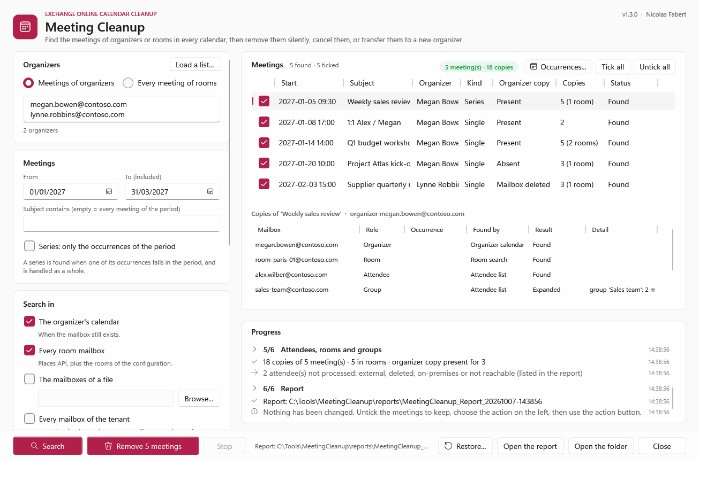

# Meeting Cleanup — User guide

> What you need before the first run, then one command per everyday question: **which meetings does this person still organize?**, **a person has left: cancel their meetings, or give them to someone else?**, **one series to remove without a message**, **rooms closed for works**, **undo a removal**. How the tool works, the rights in detail, the configuration, the report and the internals are in the [developer guide](MeetingCleanup-Guide.md).

> [!IMPORTANT]
> Files downloaded from the Internet may be blocked by Windows and fail to run. Before using this project, unblock every file in the downloaded folder:
>
> ```powershell
> Get-ChildItem "C:\Chemin\Du\Dossier" -Recurse -File -Force | Unblock-File
> ```
>
> Replace the example path with the folder where you downloaded or extracted this project.

```cards
checklist | Prerequisites | Chapter 1: PowerShell, the application and its certificate, then the one-time setup.
terminal | Everyday use | Chapter 2: one command per question, in the console or in the window.
filter | Choose the meetings | Chapter 3: who, where to search, which period, which meetings.
file | Results | Chapter 4: where the report is written, exit codes, the usual messages.
```

<!-- icon: checklist -->
## 1. Prerequisites

| Item | Requirement |
|---|---|
| Exchange | **Exchange Online** only. |
| PowerShell | **7.4 or later** (`pwsh`) — a portable zip is enough. With 7.5 and later the window has the Fluent look of Windows 11. |
| Windows | Windows 10 / 11, Windows Server 2016 to 2025. The window needs a desktop session; the command line runs anywhere (scheduled task, SSH). |
| Application | An **application registered in Microsoft Entra**, with the application permissions `Calendars.ReadWrite`, `User.Read.All`, `Place.Read.All` and `GroupMember.Read.All` (admin consent) and a **certificate** whose private key is in the certificate store of the account that runs the tool: [developer guide, chapter 5](MeetingCleanup-Guide.md#5-application). `Calendars.ReadWrite.All` works as well. |
| Your account | **No Exchange or Entra role** to run a report, Remove, Cancel or a re-creation: the application signs in with its certificate. |
| *Restore*, native *Transfer* | Module `ExchangeOnlineManagement` 3.2 or later, and a role for the application (or an administrator): [Rights for Restore](MeetingCleanup-Guide.md#rights-for-restore), [Rights for Transfer](MeetingCleanup-Guide.md#rights-for-transfer). |
| Network | HTTPS to `login.microsoftonline.com` and `graph.microsoft.com`; `outlook.office365.com` for *Restore* and a native *Transfer*. |

> [!WARNING]
> `Calendars.ReadWrite` as an application permission reaches **every mailbox** of the tenant. Keep the certificate like an administrator password (private key not exportable, on the computer that runs the tool), or limit the application to some mailboxes with **RBAC for Applications** ([developer guide, chapter 5](MeetingCleanup-Guide.md#5-application)).

### 1.1 One-time setup

```steps
Copy the tool | Unblock the files, then copy the folder, for example to `C:\Tools\MeetingCleanup`. No installer.
Certificate | On the computer that runs the tool, as the account that runs it: the commands below. Keep the thumbprint.
Application | Microsoft Entra > *App registrations*: the four permissions, **Grant admin consent**, then upload the `.cer` file ([developer guide, chapter 5](MeetingCleanup-Guide.md#5-application)).
Configure | `notepad .\config\MeetingCleanup.config.psd1`: `Tenant.TenantId`, `Tenant.Organization`, `Authentication.AppId`, `Authentication.CertificateThumbprint`.
Check | `.\Invoke-MeetingCleanup.ps1 -Organizer <your address>`: step 1 shows the application and the permissions of its token; a report changes nothing.
Restore and Transfer | Optional: `Install-Module ExchangeOnlineManagement -Scope CurrentUser -Force`, then the role groups of the developer guide, chapter 5.
```

```powershell
# On the computer that runs the tool, as the account that runs it
$cert = New-SelfSignedCertificate -Subject 'CN=MeetingCleanup' -CertStoreLocation Cert:\CurrentUser\My `
    -KeyExportPolicy NonExportable -KeySpec Signature -KeyAlgorithm RSA -KeyLength 2048 -NotAfter (Get-Date).AddYears(2)
Export-Certificate -Cert $cert -FilePath .\MeetingCleanup.cer      # upload this file to the application
$cert.Thumbprint                                                   # Authentication.CertificateThumbprint
```

<!-- icon: terminal -->
## 2. Everyday use

Run the commands from the tool folder, in PowerShell 7. A command without `-Action` is a **report**: it finds the meetings and every copy of them (organizer, attendees, rooms, members of the groups invited) and **changes nothing**. Read the report, then run the same command with an action: *Remove*, *Cancel*, *Transfer* and *Restore* show exactly what will happen and ask to type **YES**; a backup is written before any change. `-Gui` does the same in a window (2.10).

> [!IMPORTANT]
> Always start with a report. A silent removal can be undone for 14 days (2.9); a **cancellation cannot be undone**: the attendees received it.

### 2.1 Which meetings does this person still organize?

```powershell
# The coming year (default), in the organizer's calendar and the rooms
.\Invoke-MeetingCleanup.ps1 -Organizer megan.bowen@contoso.com

# A given period
.\Invoke-MeetingCleanup.ps1 -Organizer megan.bowen@contoso.com -Start 2026-11-01 -End 2026-12-31
```

Open the HTML report: the **Meetings** tab lists each meeting (a series once), click one for its copies — who has it, which rooms, how it was found.

### 2.2 A person has left, the mailbox is kept: cancel the meetings

```powershell
.\Invoke-MeetingCleanup.ps1 -Organizer megan.bowen@contoso.com -Action Cancel -Comment 'Megan Bowen has left: this meeting is cancelled.'
```

Each meeting is cancelled by its organizer, with your message: the attendees receive the cancellation, the rooms are free again, the copies left are removed.

### 2.3 A person has left, the mailbox is deleted

```powershell
# The rooms first, then every mailbox for the meetings without room
.\Invoke-MeetingCleanup.ps1 -Organizer john.doe@contoso.com -SearchIn Rooms, AllMailboxes -Start 2026-10-01 -End 2027-03-31

# Then remove, without a message, exactly what the report found
.\Invoke-MeetingCleanup.ps1 -FromReport .\reports\MeetingCleanup_Report_20261006-101500 -Action Remove
```

Use the address of the person (any of its aliases), or its X500 address when the account is gone from the directory. A deleted organizer cannot cancel: the copies are removed silently. *Every mailbox* reads about 3,000 to 5,000 mailboxes a minute; with a list of the team instead: `-SearchIn Mailboxes -MailboxFile .\team.txt`.

### 2.4 Give the meetings of a person to someone else

```powershell
.\Invoke-MeetingCleanup.ps1 -Organizer john.doe@contoso.com -SearchIn Rooms, AllMailboxes -Action Transfer -NewOrganizer jane.roe@contoso.com
```

Jane becomes the organizer of every meeting still to come. When John is still active, Exchange Online moves each meeting (the attendees see nothing); when his account or mailbox is gone, the meeting is re-created by Jane and the attendees receive **one invitation**. The report opens on its **Transfers** tab: for each meeting, from whom to whom, how, the new meeting and its invitation, what became of the old one. How each way works and its rights: [developer guide, Transfer to a new organizer](MeetingCleanup-Guide.md#transfer-to-a-new-organizer).

### 2.5 One meeting, or one series, without a message

```powershell
.\Invoke-MeetingCleanup.ps1 -Organizer megan.bowen@contoso.com -Subject 'Weekly sales review' -Action Remove
```

The copies of the attendees and the rooms are removed, nobody receives anything; a series goes whole. The organizer's own meeting stays (*Kept*): removing it would send a cancellation — choose *Cancel* for that.

### 2.6 One occurrence of a series

```powershell
# Not this Monday: the occurrence of 16 November only, cancelled for everyone
.\Invoke-MeetingCleanup.ps1 -Organizer megan.bowen@contoso.com -Subject 'Weekly sales review' -SeriesScope Occurrences `
    -Start 2026-11-16 -End 2026-11-16 -Action Cancel -Comment 'No sales review this Monday.'
```
 `-SeriesScope Occurrences`, a series is limited to its occurrences in the period: *Cancel* sends one cancellation for that date only, *Remove* takes the occurrence out of the attendees' and rooms' calendars without a message (the organizer keeps it). The series goes on. In the window: tick *Series: only the occurrences of the period*, search, select the series, then **Occurrences...** to tick the ones to act on (2.10). An occurrence removed cannot be restored.

### 2.7 Rooms closed for works

```powershell
.\Invoke-MeetingCleanup.ps1 -Room room-paris-01@contoso.com, room-paris-02@contoso.com -Start 2026-11-02 -End 2026-11-13 `
    -Action Cancel -Comment 'The rooms of the 1st floor are closed for works.'
```

Every meeting of these rooms in the period, whoever organized it. A series loses only its occurrences in the period, and goes on after. The period is required with an action.

### 2.8 The leavers of the month

```powershell
.\Invoke-MeetingCleanup.ps1 -OrganizerFile .\leavers-2026-10.txt -SearchIn Organizer, Rooms
```

A text file with one address per line, or a CSV file (`PrimarySmtpAddress`, `UserPrincipalName`, `Address`...): each mailbox is read once for all of them, and the report has an *Organizers* tab.

### 2.9 Undo a Remove

```powershell
.\Invoke-MeetingCleanup.ps1 -Action Restore -FromReport .\reports\MeetingCleanup_Remove_20261006-001346
```

The copies come back from Recoverable Items, as they were, **without a message**, and the rooms are busy again. It works for the retention of deleted items (**14 days** by default) and needs the rights of [Rights for Restore](MeetingCleanup-Guide.md#rights-for-restore). A cancelled meeting and an occurrence removed in rooms mode cannot be restored.

### 2.10 In the window

```powershell
.\Invoke-MeetingCleanup.ps1 -Gui
```



```steps
Who and where | *Meetings of organizers* (addresses, or *Load a list...*) or *Every meeting of rooms*; the period, a subject, *Series: only the occurrences of the period*; *Search in* on the left.
Search | The meetings appear on the right, each ticked; select one for its copies. The progress bar gives the step, the part done and the time left; *Stop* ends the run.
Act | Untick the meetings to keep (for a series by occurrences: *Occurrences...*, or a double-click, to tick its occurrences), choose *Remove silently*, *Cancel and clean* or *Transfer to a new organizer*, then the action button: it shows what will happen and asks to confirm.
Report | *Open the report* shows the HTML report of the run; *Restore...* undoes a Remove.
```

<!-- icon: filter -->
## 3. Choose the meetings

| Parameter | Values | Example |
|---|---|---|
| `-Organizer` | One or more addresses (any alias), or the X500 address of a deleted mailbox | `-Organizer megan.bowen@contoso.com` |
| `-OrganizerFile` | A list of organizers: text (one per line) or CSV | `-OrganizerFile .\leavers.txt` |
| `-Room` · `-RoomFile` | Rooms mode: every meeting of these rooms, whatever its organizer | `-Room room-paris-01@contoso.com` |
| `-Start` · `-End` | The period (an end date without a time is included). Default: the coming year | `-Start 2026-11-01 -End 2026-12-31` |
| `-Subject` | The subject contains this text (`*` and `?` allowed) | `-Subject 'Weekly*'` |
| `-MeetingId` | Only these meetings (column *MeetingId* of a report) | `-MeetingId 040000008200E0...` |
| `-SeriesScope` | `Whole` (default): a series is acted on whole. `Occurrences`: only its occurrences in the period (a period of one day = one occurrence) | `-SeriesScope Occurrences` |
| `-SearchIn` | Where to search (below). Default: `Organizer`, `Rooms` | `-SearchIn Rooms, AllMailboxes` |
| `-FromReport` | Act on exactly the meetings of a reviewed report | `-FromReport .\reports\MeetingCleanup_Report_...` |
| `-Action` | `Report` (default), `Remove`, `Cancel`, `Transfer`, `Restore` | `-Action Cancel` |
| `-Comment` | The message of a cancellation | `-Comment 'This meeting is cancelled.'` |
| `-NewOrganizer` | *Transfer*: the new organizer (a mailbox of the tenant) | `-NewOrganizer jane.roe@contoso.com` |
| `-Force` | No confirmation: scheduled task, script | `-Force` |
| `-Gui` | The window | `-Gui` |

| `-SearchIn` | Searches | When |
|---|---|---|
| `Organizer` | The organizer's calendar | The mailbox still exists (skipped otherwise). |
| `Rooms` | Every room mailbox of the tenant | Always useful: a meeting with a room is found even when its organizer is gone. |
| `Mailboxes` | The mailboxes of `-Mailbox` / `-MailboxFile` | A deleted organizer, meetings without room: his team. |
| `AllMailboxes` | Every mailbox of the tenant | A deleted organizer, meetings without room, team unknown (3,000 to 5,000 mailboxes a minute). |

A series is found when one of its occurrences falls in the period, and is handled as a whole — with `-SeriesScope Occurrences` and in rooms mode: its occurrences in the period only.

<!-- icon: file -->
## 4. Results

Each run writes a new folder under `reports\`, named after the action and the time (`MeetingCleanup_Remove_20261006-001346`). The console shows it at the end, with the next command to run:

- **`MeetingCleanup.html`** — the report: self-contained, it can be sent alone. Tiles, the search, and the *Meetings*, *Copies* and *Organizers* tabs, searchable and sortable; after a *Transfer*, the **Transfers** tab first: per meeting, from whom to whom, how (Exchange Online or re-created), the new meeting and what became of the old one.
- **`MeetingCleanup-Meetings.csv`**, **`-Copies.csv`**, **`-Organizers.csv`** (and **`-Transfers.csv`** after a transfer) — the same data, separator `;`, open directly in Excel.
- **`MeetingCleanup-Summary.json`** — the whole result, used by `-FromReport` and *Restore*.
- **`MeetingCleanup-Backup.json`** — Remove, Cancel, Transfer: every meeting in full, written **before** any change.

| Meeting status | Meaning |
|---|---|
| **Found** | Report only: nothing was changed. |
| **Removed** · **Cancelled** | Every copy removed · cancelled by its organizer, the copies left removed. |
| **Kept** | *Remove*: the meeting stays in its organizer's calendar (removing it would send a cancellation). |
| **Transferred** | Now organized by the new organizer. |
| **Restored** | Every copy removed by the run is back. |
| **Skipped** | Unticked, or left as it is (the reason is in the report). |
| **Partial** · **Failed** | Some · every request failed: each copy gives the Graph error. |

| Exit code | Meaning |
|---|---|
| `0` | Completed. |
| `2` | Finished with warnings: a copy not removed, a mailbox not read, an optional permission missing. The report says which. |
| `1` | Failed: read the error in red, and the log of the day in `logs\`. |

| Message | What to do |
|---|---|
| `AADSTS700016` · `AADSTS700027` | Application ID not in the tenant · certificate not uploaded to the application, or another one. |
| *Certificate ... not found* | Import the `.pfx` (not the `.cer`) for the account that runs the tool, in `Cert:\CurrentUser\My` or `LocalMachine\My`. |
| *no application permission Calendars.ReadWrite* | Permission missing, or admin consent not granted (`Calendars.ReadWrite.All` counts as well). |
| A mailbox *could not be read: access denied* | The application is limited to some mailboxes (RBAC for Applications, access policy). |
| *Confirmation needed: run interactively, or add -Force* | An action without a console (scheduled task): add `-Force`. |
| *The restore needs the module ExchangeOnlineManagement 3.2 or later* | `Install-Module ExchangeOnlineManagement -Scope CurrentUser -Force`. |
| *Get-RecoverableItems is not available* · *Invoke-ChangeMeetingOrganizer ... is not available* | The role of Restore or Transfer is missing, or not applied yet (up to an hour). |

Anything else: [developer guide, Appendix A — Troubleshooting](MeetingCleanup-Guide.md#appendix-a---troubleshooting); every status and column of the report: [developer guide, chapter 10](MeetingCleanup-Guide.md#10-reading-the-report).
