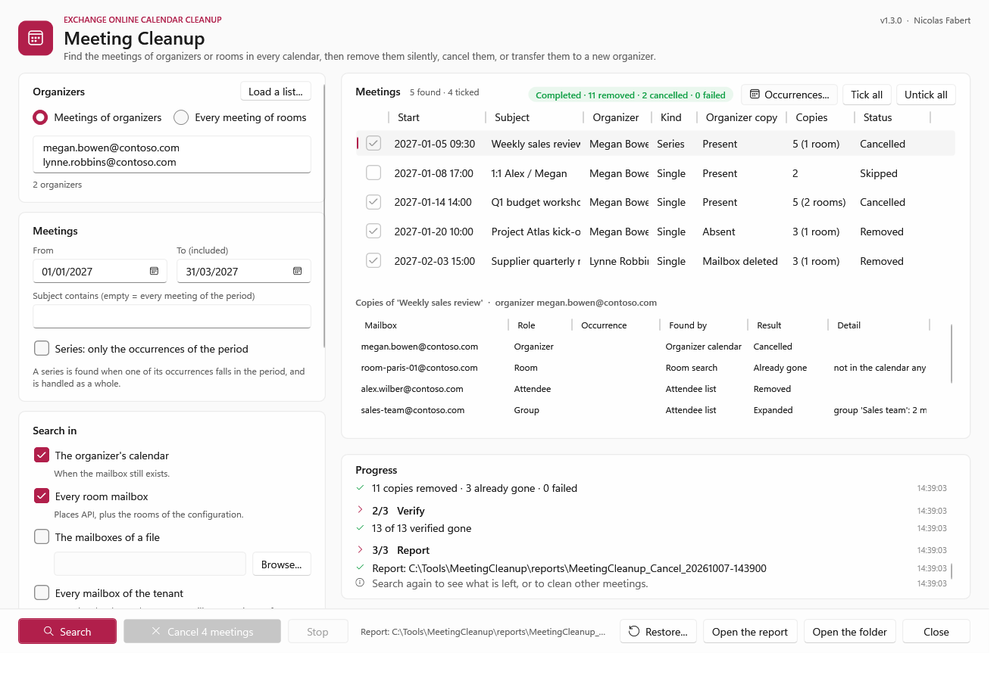
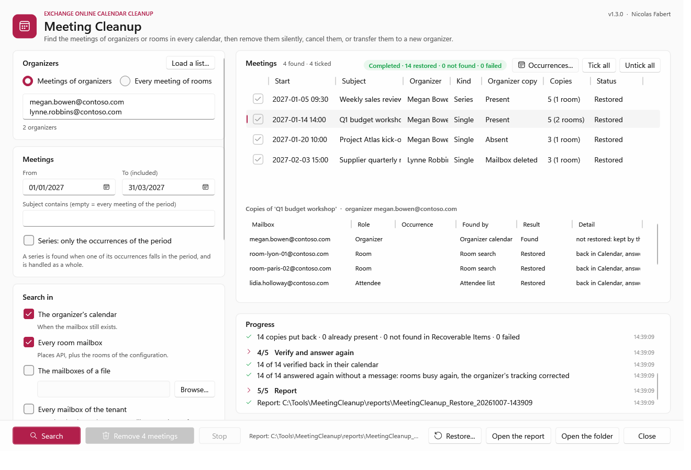

# Meeting Cleanup — Developer guide

> Finds the meetings of one or many organizers — whether the mailbox still exists or has been deleted — or **every meeting of some rooms** in **Exchange Online**: one meeting, a series or every meeting of a period, in **every calendar** where they are: the organizer, the rooms, the attendees, the members of the groups invited. Then removes them **silently**, has the organizer **cancel** them, or **transfers** them to a new organizer; a silent removal can be **undone**. Console, window, CSV, JSON and HTML reports.

> [!IMPORTANT]
> Files downloaded from the Internet may be blocked by Windows and fail to run. Before using this project, unblock every file in the downloaded folder:
>
> ```powershell
> Get-ChildItem "C:\Chemin\Du\Dossier" -Recurse -File -Force | Unblock-File
> ```
>
> Replace the example path with the folder where you downloaded or extracted this project.
>
> The `Install-Module` commands in this documentation use `-Force`, so they also update or reinstall a module that is already installed. If an older version still conflicts, close every PowerShell window, open a new one (as administrator for `-Scope AllUsers`), run `Uninstall-Module <ModuleName> -AllVersions -Force`, then run the `Install-Module` command again.

> [!NOTE]
> This is the **developer guide**: how the tool works, the actions in detail, the rights, every setting, the window, the report, the architecture and how to modify and validate the tool. For the prerequisites and the everyday commands only, read the [user guide](MeetingCleanup-UserGuide.md).

```cards
user | Organizers present | One address, or a list of them (`-OrganizerFile`); Cancel sends the cancellation with your message and frees the rooms.
ban | Organizers deleted | The meetings are found in the rooms, a list of mailboxes or every mailbox, from the address of the person.
calendar | One meeting, a series, a period | `-Subject`, `-MeetingId`, `-Start` / `-End`. A series is handled as a whole.
refresh | Silent, and reversible | *Remove* sends nothing and keeps a backup; *Restore* puts the copies back from Recoverable Items. *Cancel* is the organizer cancelling.
building | Rooms over a period | `-Room` / `-RoomFile`: every meeting of the rooms, whatever its organizer — a room closed for works. A series loses only its occurrences in the period.
people | Transfer to a new organizer | `-Action Transfer -NewOrganizer`: moved by Exchange Online, or re-created by the new organizer when the old mailbox is gone.
```

## Quick start

```steps
Install | Copy the folder, unblock the files, check PowerShell 7.4 or later (chapter 6).
Application | Register an application in Microsoft Entra with `Calendars.ReadWrite`, `User.Read.All`, `Place.Read.All` and `GroupMember.Read.All` (application permissions, admin consent) and a certificate (chapter 5).
Configure | Tenant, application and certificate in `config\MeetingCleanup.config.psd1` (chapter 7).
Report | `.\Invoke-MeetingCleanup.ps1 -Organizer john.doe@contoso.com` lists the meetings of the coming year and every copy of them. Nothing is changed.
Act | Read the report, then the same command with `-Action Cancel` or `-Action Remove` (or `-FromReport <folder>` for exactly the meetings reviewed). Or `-Gui` for the window.
Undo | `-Action Restore -FromReport <folder of the Remove run>` puts the removed copies back, without a message (chapter 4; rights in chapter 5).
Rooms, transfer | `-Room <rooms> -Start -End -Action Cancel` empties rooms over a period; `-Action Transfer -NewOrganizer <address>` gives the meetings of a leaver to someone else (chapter 4).
```

> [!IMPORTANT]
> Always start with a **report** (the default action). Removed copies cannot be restored by the users; the tool can (*Restore*), for the retention of deleted items (14 days by default). A **cancellation cannot be undone**: the attendees received it.

# Part I · Understand

<!-- icon: target -->
## 1. Purpose

Meetings outlive the people and the decisions behind them. A person leaves and their weekly meetings keep booking the rooms; an organizer deletes a meeting without sending the cancellation and it stays in every attendee's calendar; a mailbox is deleted and its meetings can no longer be cancelled by anyone. In each case the meeting exists in many mailboxes, and each copy has to be found and removed.

Meeting Cleanup replaces two older scripts (one per organizer, one for every mailbox) with one tool: the same search for every case, the same report, a window for the administrators who prefer it, and a clear choice between a silent removal, a cancellation and a transfer to another organizer. Rooms can be emptied over a period, whoever booked them.

```cards
search | Found everywhere | One copy of a meeting holds its whole attendee list: every internal attendee, room and group member is then asked for its own copy.
shield | Nothing by surprise | The report is the default. Remove and Cancel say exactly what will happen and ask to confirm.
check | Verified | Each copy removed is read again; the report gives the Graph answer of every request.
refresh | Replayable, reversible | `-FromReport` acts on the meetings of a reviewed report, by their IDs; a backup is written before any change, and *Restore* undoes a *Remove*.
```

The tool reads and changes calendars only. It never reads a message body, and it changes no setting of Exchange Online or Microsoft Entra.

<!-- icon: flow -->
## 2. How it works

```flow
user | Organizer | addresses, mailbox
arrow | where | 
search | Mailboxes | organizer, rooms, list, all
arrow | period | series too
calendar | Search | organizer compared
arrow | iCalUId | in every copy
people | Attendees | rooms, groups
arrow | confirm | 
trash | Action | remove or cancel
```

| Stage | What happens |
|---|---|
| **Organizer** | The addresses of each organizer (primary, aliases, X500) from the directory, and whether its mailbox can still be opened. An address that is not in the directory any more is searched as typed. A list of organizers is searched in one pass: each mailbox is read once for all of them. *Rooms mode*: no organizer, the rooms given are the place to search, every meeting found there is kept. |
| **Mailboxes** | Where to search (`-SearchIn`): the organizer's calendar, every room (places API and the rooms of the configuration), a list of mailboxes, every mailbox of the tenant. |
| **Search** | In each mailbox, the calendar items of the period and every series; the organizer is compared on this side (Graph refuses a filter on the organizer). A series is kept when one of its occurrences falls in the period. |
| **Attendees** | For each meeting, its best copy gives the subject and the attendee list; every internal attendee, room and member of an invited group is asked for its copy by **iCalUId** (the same in every copy of a meeting). External or deleted attendees are listed, not processed. |
| **Backup** | Before Remove or Cancel: every meeting (read in full) and the state of each copy in `Backup.json`, in the folder of the run. |
| **Action** | Remove, Cancel or Transfer (chapter 4), then each copy removed is read again. *Restore* puts back the copies of a Remove run. |
| **Report** | CSV, JSON and HTML in a new folder; a daily log. |

<!-- icon: layers -->
## 3. The cases

Every case is the same command: what changes is the organizer state, what is searched and where.

| Case | Command (add `-Action Remove` or `-Action Cancel` once the report is reviewed) |
|---|---|
| **One meeting**, still in the organizer's calendar | `-Organizer <address> -Subject 'Weekly review'` |
| **One meeting** no longer in the organizer's calendar (deleted without cancellation) | `-Organizer <address> -Subject 'Weekly review' -SearchIn Rooms` — or `Mailboxes`, `AllMailboxes` when it had no room |
| **A series**, present or not at the organizer | the same: a series is one meeting, handled as a whole (every occurrence and exception) |
| **One or some occurrences of a series** | `-Organizer <address> -Subject 'Weekly review' -SeriesScope Occurrences -Start 2026-11-16 -End 2026-11-16` — or the window: *Series: only the occurrences of the period*, then *Occurrences...* to tick them (below) |
| **A period**, organizer present | `-Organizer <address> -Start 2026-11-01 -End 2026-12-31` |
| **A period**, organizer deleted | `-Organizer <old address> -SearchIn Rooms` then, for the meetings without room, `-SearchIn Mailboxes -MailboxFile .\team.txt` or `-SearchIn AllMailboxes` |
| **A meeting chosen in a report** | `-Organizer <address> -MeetingId <MeetingId of the report>`, or `-FromReport <folder> -MeetingId <id>` |
| **Several organizers** (leavers of the month, a team) | `-OrganizerFile .\leavers.txt` (or `-Organizer a@contoso.com, b@contoso.com`) with any of the cases above |
| **Undo a Remove** | `-Action Restore -FromReport <folder of the Remove run>` |
| **Every meeting of some rooms** over a period (works, closed floor) | `-Room room-paris-01@contoso.com, room-paris-02@contoso.com -Start 2026-11-02 -End 2026-11-13` (or `-RoomFile`) — then `-Action Cancel -Comment '...'` |
| **Give the meetings of a person to someone else** (present or deleted mailbox) | `-Organizer <address> -SearchIn Rooms, AllMailboxes -Action Transfer -NewOrganizer <address>` |

The default search is the organizer's calendar and the rooms (`Search.SearchIn`), over the coming year (`Search.PastDays`, `Search.FutureDays`). The organizer's calendar is skipped when its mailbox no longer exists.

> [!TIP]
> A deleted organizer whose meetings had no room can only be found in the attendees' calendars: give the team in a file (`-SearchIn Mailboxes -MailboxFile`), or search every mailbox (`-SearchIn AllMailboxes`, about 3,000 to 5,000 mailboxes a minute).

<!-- icon: compare -->
## 4. The actions

What Exchange Online does, measured in a lab tenant with Microsoft Graph v1.0 (Appendix C):

| Request | Messages sent | Effect |
|---|---|---|
| Remove the copy of an **attendee** or a **room** (`permanentDelete`) | **none** — no response to the organizer | the copy goes to Recoverable Items (purges): gone for the user, restorable by an administrator |
| Remove the meeting from the **organizer's** calendar (`DELETE` or `permanentDelete`) | **a cancellation to every attendee still invited**, external ones included | Graph has no silent way to remove an organizer's meeting |
| **Cancel** by the organizer (`cancel`) | the cancellation with your message | rooms release the slot themselves; attendees see *Canceled:* until they remove it |

So the two actions are:

| Action | Organizer's meeting | Attendees and rooms | Messages |
|---|---|---|---|
| **Remove** (silent) | **left as it is** when the mailbox still exists | copies removed | none |
| **Cancel** (and clean) | cancelled, with the message of `-Comment` (`Cleanup.CancelComment`) | copies left after the cancellation removed | the cancellation, to every attendee |

- A meeting **no longer in the organizer's calendar**, or whose organizer is deleted, cannot be cancelled: with *Cancel* its copies are removed silently, and the report says so.
- With *Remove*, a meeting that stays at the organizer is marked **Kept**: if the organizer (or someone with access to the mailbox) later removes it, Exchange will send the cancellation then. Choose *Cancel* to do it now, with a message.
- If the cancellation fails, the copies of that meeting are left untouched (**Not done**), so that the meeting stays consistent.
- A series is cancelled or removed as a whole, past occurrences included — unless it is limited to its occurrences in the period (*Occurrences of a series*, below, and the rooms mode).

### Occurrences of a series

`-SeriesScope Occurrences` (`Search.SeriesScope`, or *Series: only the occurrences of the period* in the window) limits each series found to **its occurrences in the period**, as the rooms mode does, but for the meetings of organizers and without any room. With a period of one day, one occurrence.

- The occurrences are those of the **organizer's calendar**; when the organizer has no mailbox any more, those of the copies of the attendees and the rooms. Each copy (organizer, attendees, rooms) is replaced by its occurrences of the period, each with its own ID, matched by its original start (an occurrence moved to another time is still found).
- *Cancel*: the organizer cancels these occurrences only — **one cancellation per occurrence**, with your message, to every attendee — then the copies left are removed. *Remove*: these occurrences go from the attendees' and the rooms' calendars without any message; the organizer keeps them. The series goes on before and after.
- **In the window, the occurrences can be chosen one by one**: select the series, then *Occurrences...* (or double-click it): ticked = acted on, unticked = left as they are. *Kind* shows `2/4 occ.`; the report keeps the choice (column *OccurrencesSkipped*, copies *Skipped*), and a replay (`-FromReport`) too.
- A series whose every occurrence is in the period is still acted on occurrence by occurrence (a note says so): `-SeriesScope Whole` cancels it at once.
- With an action, the period must be given (`-Start` and `-End`). An occurrence removed is **not restorable** (Exchange does not keep it in Recoverable Items). *Transfer* moves whole series: not available by occurrences.
- When the occurrences of the organizer cannot be read, the series is left as it is (*Not processed*).

Measured in the lab (2026-10-07, Appendix C): one occurrence of a weekly series cancelled from the command line — gone at the organizer and the attendee, one *Canceled:* for that date, the three others intact; then, in the window, two occurrences of the period, one unticked, *Remove silently* — only the one ticked gone from the attendee, no message.


### Rooms over a period

`-Room` (or `-RoomFile`, or *Every meeting of rooms* in the window) searches the rooms given and keeps **every meeting** found there in the period, whatever its organizer — present, gone, or the room itself. Each meeting is then found everywhere, as always (attendees, other rooms, group members). Typical: a floor closed for works, a room taken out of service.

- **A series is limited to its occurrences in the period**: each copy (organizer, attendees, rooms) is replaced by its occurrences of the period, each with its own ID. *Cancel* cancels these occurrences only (one cancellation per occurrence, with your message); *Remove* takes them out of the attendees' and the rooms' calendars. The series goes on before and after. Only the occurrences **the rooms hold** count: one moved to another room is left as it is. A series whose every occurrence is held by the rooms in the period is handled whole. When the occurrences of the organizer or of a room cannot be read, the series is left as it is (*Not processed*): never the attendees without their organizer.
- With an action, the period must be given (`-Start` and `-End`): a room mode on the default year would empty a year of bookings.
- A meeting whose organizer is gone cannot be cancelled: its copies (and occurrences) are removed silently, as with organizers.
- **An occurrence removed is not restorable**: Exchange does not keep it in Recoverable Items (measured, Appendix C). `Backup.json` lists them. Single meetings removed are restorable as usual.
- *Transfer* is for the meetings of organizers: not available in rooms mode.


### Transfer to a new organizer

`-Action Transfer -NewOrganizer <address>` (or *Transfer to a new organizer* in the window) gives the meetings found to another person, who becomes their organizer. Two ways, chosen for each meeting by `-TransferMethod` (`Transfer.Method`):

| Way | When (Auto) | What the attendees see | Rights |
|---|---|---|---|
| **Native** — Exchange Online moves the meeting (`Invoke-ChangeMeetingOrganizer`) | the old organizer is **active**: the meeting in his mailbox and his account not deleted (an account the application cannot look up, without `User.Read.All`, counts as active) | nothing for the attendees of the organization (their copy is updated, their answer kept); external and on-premises attendees receive a cancellation and an invitation | Exchange Online PowerShell, role *Meeting Organizer Transfer* (chapter 5) |
| **Recreate** — the tool re-creates the meeting in the new organizer's calendar | the old organizer is **gone**: account deleted, mailbox deleted or soft-deleted | **one invitation** from the new organizer (they answer again); the old copy disappears without a message | Microsoft Graph only |

How *Recreate* works, measured in the lab (Appendix C):

```steps
Read | The meeting in full from its best copy (organizer, else an attendee, else a room), in its own time zone (the one of the copy, else the time zone of the report); for a series, its occurrences still to come, from the organizer's copy (or an attendee's and a room's).
Create | The meeting created in the new organizer's calendar **without attendees**: a plain appointment, nothing is sent. A series starts with its next occurrence (or the slot of an occurrence moved from the past to a later date).
Shape | The occurrences removed from the old series are removed from the new one, the occurrences moved or renamed are moved or renamed — still without any message. Every occurrence still to come of the old series must find its slot in the new one: otherwise (a time zone that cannot be known, such as a custom one) the meeting is not transferred.
Rooms | The old copies of the rooms are removed (silent): their slots are free.
Invite | The attendees and the rooms are added: **one invitation**, the occurrences already shaped. The rooms accept without conflict.
Old copies | Removed from the attendees (silent). When the old organizer is still active, he cancels his meeting with the message `Transfer.Comment` ("This meeting is now organized by ..."): Exchange sends one cancellation per exception of the old series.
```

- If a step fails **before** the invitation, the new meeting is removed (nothing had been sent) and the meeting is *Failed*; old room copies already removed come back with `-Action Restore -FromReport <transfer report>`.
- *Recreate* moves the meeting **from now**: the old meeting goes whole, its past occurrences included (they are in `Backup.json`). `-TransferFrom` applies to *Native* only (the occurrences before stay with the old organizer).
- A transfer starts from a search of organizers (a rooms search is refused). A Transfer report replayed (`-FromReport`) skips the meetings it transferred and never removes a new organizer's meeting: replay it to retry the *Failed* ones.
- A meeting re-created with a Teams link gets a new link for the new organizer; the text of the invitation may still show the old one.
- In the lab (2026-10-06), Exchange Online answered `Invoke-ChangeMeetingOrganizer` with *A server side error has occurred* whatever the identity and the ID — app-only, administrator, `-EventId`, `-Subject`, `-WhatIf`. The tool reports such a meeting *Failed* and gives the command to re-create it (`-TransferMethod Recreate`).


### Undo a Remove: Restore

A copy removed by the tool is not gone at once: Exchange Online keeps it in **Recoverable Items\Purges** of the mailbox for the retention of deleted items (**14 days** by default, up to 30; as long as a hold lasts). *Restore* puts it back, as it was:

```powershell
.\Invoke-MeetingCleanup.ps1 -Action Restore -FromReport .\reports\MeetingCleanup_Remove_20261006-001346
```

```flow
file | Report | Remove run
arrow | Graph | 
check | Already back? | iCalUId
arrow | Exchange | PowerShell
refresh | Recoverable Items | Purges
arrow | verify | 
people | Answer again | silently
```

| Step | What happens |
|---|---|
| **Copies to restore** | From the `Summary.json` of the run: the copies with the result *Removed*, with the time each one was removed. |
| **Already back?** | Each copy is looked up by iCalUId in its calendar: a copy already there (put back by someone, or a second restore) is *Already present*. |
| **Recoverable Items** | Exchange Online PowerShell (`Get-RecoverableItems`, 10 mailboxes at a time) lists the meetings removed in each mailbox around the time of the removal (± `Restore.WindowMinutes`). The copy is found by its subject (a room shows the organizer's name) and the time of its removal; when one mailbox has several copies with the same subject, by the order of the removals (*Remove* leaves 3 seconds between them). `Restore-RecoverableItems -EntryID` puts back that very item — same ID, same content — in *Calendar*. |
| **Verify** | Each copy is read again by iCalUId. |
| **Answer again** | When Exchange removed the copy, it marked it *Declined* / *Free* and told the organizer's tracking, without a message. The copy is answered again **without a message** (`sendResponse = false`): *Accepted* for a room or an attendee who had accepted, *Tentative* for an attendee who had not answered. The room is **busy** again and the organizer's tracking is right again. |

- **No message** is sent, to anyone: the attendees find the meeting in their calendar, as before.
- **A restore never removes anything.** When the item of a copy is not certain — the items with its subject in Recoverable Items are not exactly the copies the run removed there, or two of them have the same second — nothing is restored for that subject in that mailbox: the copy is *Failed*, with the `Get-RecoverableItems` command to do it by hand. A wrong meeting is never put back on a guess.
- **The same restore again finishes the previous one**: after a *Stop*, or a copy not verified (Graph not answering), the copies already back are *Already present*; those still *Declined* / *Free* from the removal are answered again. A copy the attendee had declined is left as it is. The run is *Warning* (exit code 2) as long as a copy is not verified or not answered again.
- **A cancellation cannot be undone**: the attendees received it. In a *Cancel* run, only the copies removed silently (meetings without an organizer copy) can be restored; the cancelled meetings are *Not restorable* — the organizer sends them again.
- The **backup** (`Backup.json`, written before any change) holds every meeting in full (body, attendees, recurrence) and the state of each copy: what was there, even after the retention of deleted items.
- Restore works with the reports of version 1.0.0 too: the time of the run is used for each copy.

# Part II · Set up

<!-- icon: key -->
## 5. Application

The tool signs in as an **application** (no user), with application permissions of Microsoft Graph and admin consent:

| Permission | Why | Without it |
|---|---|---|
| `Calendars.ReadWrite` | read the calendars, remove a copy, cancel a meeting | required; `Calendars.Read` is enough for a report |
| `User.Read.All` | the addresses of the organizer (aliases, X500), the list of every mailbox | only the address typed is compared; *every mailbox* is not available |
| `Place.Read.All` | the list of the room mailboxes | rooms only from `Search.Rooms` / `Search.RoomFile` (and from the attendee lists) |
| `GroupMember.Read.All` | the members of a group invited to a meeting | their copies are not looked up |

> [!NOTE]
> **`Calendars.ReadWrite.All` works too.** Microsoft Graph documents `Calendars.ReadWrite.All` and `Calendars.Read.All` for the work hours and locations of the users, but Exchange Online accepts them for the events (lab, 2026-10-07: with `Calendars.ReadWrite.All` alone, events read, created and removed; with `Calendars.Read.All` alone, read only). The tool counts them as `Calendars.ReadWrite` and `Calendars.Read`. `Calendars.ReadWrite` remains the permission documented for the events.

1. **Entra admin center** > *App registrations* > *New registration*: name *Meeting Cleanup*, single tenant, no redirect URI.
2. *API permissions* > *Add a permission* > *Microsoft Graph* > *Application permissions*: the four permissions above, then **Grant admin consent**.
3. *Certificates & secrets* > *Certificates* > *Upload certificate*: the `.cer` file of a certificate whose private key is on the computer that runs the tool:

```powershell
# On the computer that runs the tool, as the account that runs it
$cert = New-SelfSignedCertificate -Subject 'CN=MeetingCleanup' -CertStoreLocation Cert:\CurrentUser\My `
    -KeyExportPolicy NonExportable -KeySpec Signature -KeyAlgorithm RSA -KeyLength 2048 -NotAfter (Get-Date).AddYears(2)
Export-Certificate -Cert $cert -FilePath .\MeetingCleanup.cer      # upload this file to the application
$cert.Thumbprint                                                   # Authentication.CertificateThumbprint
```

4. Copy the *Application (client) ID* and the *Directory (tenant) ID* into the configuration (chapter 7).

A client secret also works (`Authentication.Mode = 'ClientSecret'`): it is read from the environment variable `MCL_CLIENT_SECRET`, or typed at each run (window: *Connection*), and never written. Microsoft recommends a certificate.

> [!NOTE]
> **Limit the mailboxes the application can reach.** `Calendars.ReadWrite` applies to every mailbox of the tenant. To restrict it, use **RBAC for Applications** in Exchange Online (role *Application Calendars.ReadWrite* assigned to the service principal with a management scope) instead of the Graph permission, or an application access policy. A mailbox outside the scope is reported as *access denied*, not as an error of the tool.

### Rights for Restore

Graph cannot read Recoverable Items: *Restore* uses **Exchange Online PowerShell** (module `ExchangeOnlineManagement` 3.2 or later) and the role **Mailbox Import Export**, which is in no role group by default. Two ways (`Restore.Connection`):

| Connection | Set up once | At each restore |
|---|---|---|
| **Application** (default) | The same application and certificate: API permission *Office 365 Exchange Online* > *Application permissions* > `Exchange.ManageAsApp` (admin consent), and its service principal in a role group with *Mailbox Import Export* (below). | Nothing: the certificate signs in. `Tenant.Organization` must be the initial domain (`contoso.onmicrosoft.com`). |
| **Interactive** | An administrator with the role *Mailbox Import Export* (a role group of yours, below). | The administrator signs in (`Restore.UserPrincipalName`, MFA as usual). |

```powershell
# Exchange Online PowerShell, as an Exchange administrator - once
# ObjectId: Entra > Enterprise applications > Meeting Cleanup > Object ID (not the one of the App registration)
New-ServicePrincipal -AppId '<AppId>' -ObjectId '<ObjectId of the enterprise application>' -DisplayName 'Meeting Cleanup'
New-RoleGroup -Name 'Meeting Cleanup Restore' -Roles 'Mailbox Import Export' `
    -Description 'Restore of the meetings removed by Meeting Cleanup (Recoverable Items).'
$sp = Get-ServicePrincipal -Identity 'Meeting Cleanup'
Add-RoleGroupMember -Identity 'Meeting Cleanup Restore' -Member $sp.Identity
# Interactive way instead: Add-RoleGroupMember -Identity 'Meeting Cleanup Restore' -Member <administrator>
```

The role changes take up to an hour to apply. The tool checks at the start that `Get-RecoverableItems` and `Restore-RecoverableItems` are available, and says which role is missing otherwise.

> [!CAUTION]
> *Mailbox Import Export* also allows `New-MailboxExportRequest` and the search of every mailbox. Give it to this application (or these administrators) only, and keep the certificate like a password: the private key not exportable, on the computer that runs the tool.

### Rights for Transfer

*Recreate* needs nothing more than `Calendars.ReadWrite`: the new meeting is created in the new organizer's calendar with Microsoft Graph. *Native* uses `Invoke-ChangeMeetingOrganizer` (Exchange Online PowerShell, the same connection as the restore: `Exchange.ManageAsApp` for the application). Its parameters `-EventId` and `-NewOrganizer` are in the roles *Mail Recipients* and *User Options* only (other roles show the cmdlet with `-Identity` alone). The least: a role of its own, from *User Options*, with this cmdlet only:

```powershell
# Exchange Online PowerShell, as an Exchange administrator - once
New-ManagementRole -Parent 'User Options' -Name 'Meeting Organizer Transfer' -Description 'Meeting Cleanup: Invoke-ChangeMeetingOrganizer only.'
Get-ManagementRoleEntry 'Meeting Organizer Transfer\*' | Where-Object Name -ne 'Invoke-ChangeMeetingOrganizer' |
    ForEach-Object { Remove-ManagementRoleEntry -Identity "Meeting Organizer Transfer\$($_.Name)" -Confirm:$false }
New-RoleGroup -Name 'Meeting Cleanup Transfer' -Roles 'Meeting Organizer Transfer' -Description 'Meeting Cleanup: transfer of meetings to a new organizer.'
Add-RoleGroupMember -Identity 'Meeting Cleanup Transfer' -Member (Get-ServicePrincipal -Identity 'Meeting Cleanup').Identity
```

Without that role, a native transfer stops with the name of the role to give; `-TransferMethod Recreate` works without it.

<!-- icon: download -->
## 6. Installation

| Need | Detail |
|---|---|
| PowerShell | **7.4 or later**. With 7.5 and later (.NET 9) the window uses the Fluent theme of Windows 11; with 7.4 the classic look with the same colours. |
| Windows | Windows 10 / 11, Windows Server 2016 to 2025. The window needs a desktop session; the command line runs anywhere (scheduled task, SSH). |
| Modules | **None** for the search, Remove, Cancel and a re-creation: the token is built by the tool from the certificate. *Restore* and a native *Transfer* only: `ExchangeOnlineManagement` 3.2 or later (`Install-Module ExchangeOnlineManagement -Scope CurrentUser -Force`). |
| Network | `login.microsoftonline.com` and `graph.microsoft.com` over HTTPS; `outlook.office365.com` for *Restore* and a native *Transfer*. |

Copy the folder, then unblock the files downloaded from the Internet:

```powershell
Get-ChildItem 'C:\Tools\MeetingCleanup' -Recurse -File -Force | Unblock-File
```

<!-- icon: settings -->
## 7. Configuration

`config\MeetingCleanup.config.psd1` is a PowerShell data file. Every value is checked at start and all the problems are listed at once; the parameters of the command line override it for one run.

| Setting | Default | Meaning |
|---|---|---|
| `Tenant.TenantId` | | Tenant ID (GUID) or domain. The tool stops if the token belongs to another tenant. |
| `Tenant.Organization` | | Shown in the console and the report. |
| `Authentication.Mode` | `Certificate` | `Certificate` or `ClientSecret`. |
| `Authentication.AppId` | | Application (client) ID. |
| `Authentication.CertificateThumbprint` | | In `Cert:\CurrentUser\My` or `Cert:\LocalMachine\My`, with its private key. |
| `Authentication.ClientSecretVariable` | `MCL_CLIENT_SECRET` | Environment variable of the secret. |
| `Search.SearchIn` | `Organizer`, `Rooms` | Default of `-SearchIn`. |
| `Search.PastDays` · `FutureDays` | `0` · `365` | Default period: today minus *PastDays* to today plus *FutureDays* (included). |
| `Search.SeriesScope` | `Whole` | `Whole`: a series acted on whole; `Occurrences`: only its occurrences in the period (chapter 4). The window starts with its option ticked when `Occurrences`. |
| `Search.Rooms` · `RoomFile` | | Rooms added to the places API (a new room can take time to appear there). |
| `Search.MailboxFile` | | Default file of the `Mailboxes` scope. |
| `Cleanup.CancelComment` | *This meeting has been cancelled by the IT department.* | Message of *Cancel* (plain text). |
| `Cleanup.Verify` | `$true` | Read each removed copy again. |
| `Restore.Connection` | `Application` | Exchange Online PowerShell for *Restore*: `Application` (the same application and certificate) or `Interactive` (an administrator signs in). Chapter 5. |
| `Restore.UserPrincipalName` | | *Interactive*: the administrator (empty = the sign-in window asks). |
| `Restore.WindowMinutes` | `10` | Tolerance around the time of each removal, to find it in Recoverable Items. |
| `Restore.ReAccept` | `$true` | Answer each restored copy again, silently, so that a room is busy again (chapter 4). |
| `Transfer.Method` | `Auto` | `Auto` (native for an active organizer, re-created otherwise), `Native` or `Recreate`. Chapter 4. |
| `Transfer.Comment` | *This meeting is now organized by {0}.* | Message of an active old organizer whose meeting is re-created (`{0}` = the new organizer). |
| `Graph.MaxConcurrency` | `16` | `$batch` calls in flight (1-32). |
| `Graph.PageSize` · `MaxRetries` · `TimeoutSeconds` | `500` · `6` · `120` | Calendar items per page; retries of a 429 or 5xx (after *Retry-After*); timeout of a request. |
| `Report.OutputPath` · `FilePrefix` · `Formats` · `CsvDelimiter` | `.\reports` · `MeetingCleanup` · `Csv`, `Html` · `;` | Report files (a `Summary.json` is always written). |
| `Report.TimeZone` | *Windows* | Time zone of the dates typed and shown (`Europe/Paris`...). |
| `Logging.Path` · `RetentionDays` | `.\logs` · `30` | One log file per day. |

A file of mailboxes (`-MailboxFile`, `Search.MailboxFile`, `Search.RoomFile`) is a text file with one address per line (`#` = comment), or a CSV file with a column `PrimarySmtpAddress`, `EmailAddress`, `Mail`, `WindowsEmailAddress`, `UserPrincipalName` or `Address` — for example the export of `Get-Mailbox | Select-Object PrimarySmtpAddress`. A file of organizers (`-OrganizerFile`, *Load a list...* in the window) is the same, and also accepts X500 addresses and the columns `Organizer` and `LegacyExchangeDN` (the SMTP address of a row is taken first, its X500 address when it has none).

# Part III · Use

<!-- icon: terminal -->
## 8. Command line

| Parameter | Meaning |
|---|---|
| `-Organizer` | SMTP address (any alias), or the X500 address (legacyExchangeDN) of a deleted mailbox. Several organizers may be given. |
| `-OrganizerFile` | A list of organizers: text file (one address per line) or CSV file (chapter 7). Added to `-Organizer`. |
| `-Room` · `-RoomFile` | Rooms mode: every meeting of these rooms in the period, whatever its organizer (instead of `-Organizer`). With an action, `-Start` and `-End` are required. |
| `-Start` · `-End` | The period, in `Report.TimeZone`; an end date without a time is included. |
| `-Subject` | Only the meetings whose subject contains this text (`*` and `?` are wildcards). The real subject is used, not the organizer's name a room shows. |
| `-SeriesScope` | `Whole` (default, `Search.SeriesScope`): a series is acted on whole. `Occurrences`: only its occurrences in the period (chapter 4); with an action, give `-Start` and `-End`. |
| `-MeetingId` | Only these meetings (column *MeetingId* of the report). |
| `-SearchIn` | `Organizer`, `Rooms`, `Mailboxes`, `AllMailboxes`. |
| `-Mailbox` · `-MailboxFile` | The mailboxes of the `Mailboxes` scope. |
| `-Action` | `Report` (default), `Remove`, `Cancel`, `Transfer`, `Restore` (with `-FromReport` of a Remove, Cancel or Transfer run). |
| `-Comment` | Message of the cancellation; with `Transfer`, the message of an active old organizer (`{0}` = the new organizer). |
| `-NewOrganizer` · `-TransferMethod` · `-TransferFrom` | *Transfer*: the new organizer (a mailbox of the tenant), `Auto` · `Native` · `Recreate`, and the date a native transfer starts from. |
| `-FromReport` | Folder (or `Summary.json`) of a report: act on exactly its meetings. With `Restore`: the run to undo. |
| `-Force` | No confirmation (scheduled task, script). Without it, Remove, Cancel, Transfer and Restore show the plan and ask to type **YES**. |
| `-Gui` | The window. |
| `-TenantId` · `-AppId` · `-CertificateThumbprint` · `-OutputPath` · `-NoReport` · `-ConfigPath` | Overrides of the configuration. |

```powershell
# What is there? (nothing is changed)
.\Invoke-MeetingCleanup.ps1 -Organizer megan.bowen@contoso.com

# Megan has left but her mailbox is kept: cancel her meetings with a message, clean every calendar
.\Invoke-MeetingCleanup.ps1 -Organizer megan.bowen@contoso.com -Action Cancel -Comment 'Megan Bowen has left: this meeting is cancelled.'

# One series, removed silently from the attendees and the rooms
.\Invoke-MeetingCleanup.ps1 -Organizer megan.bowen@contoso.com -Subject 'Weekly sales review' -Action Remove

# Deleted mailbox: rooms first, then every mailbox for the meetings without room
.\Invoke-MeetingCleanup.ps1 -Organizer john.doe@contoso.com -SearchIn Rooms, AllMailboxes -Start 2026-10-01 -End 2027-03-31

# Act on exactly what was reviewed
.\Invoke-MeetingCleanup.ps1 -FromReport .\reports\MeetingCleanup_Report_20261005-201500 -Action Remove

# The leavers of the month (one address per line), every meeting of the coming year
.\Invoke-MeetingCleanup.ps1 -OrganizerFile .\leavers-2026-10.txt -SearchIn Organizer, Rooms

# Undo a Remove: the copies come back, without a message
.\Invoke-MeetingCleanup.ps1 -Action Restore -FromReport .\reports\MeetingCleanup_Remove_20261005-203000

# Two rooms closed for works: every meeting of the period cancelled by its organizer (an occurrence for a series)
.\Invoke-MeetingCleanup.ps1 -Room room-paris-01@contoso.com, room-paris-02@contoso.com -Start 2026-11-02 -End 2026-11-13 -Action Cancel -Comment 'The rooms of the 1st floor are closed for works.'

# Not this Monday: one occurrence of a weekly series cancelled, the series goes on
.\Invoke-MeetingCleanup.ps1 -Organizer megan.bowen@contoso.com -Subject 'Weekly sales review' -SeriesScope Occurrences -Start 2026-11-16 -End 2026-11-16 -Action Cancel -Comment 'No sales review this Monday.'

# John has left (mailbox deleted): Jane organizes his meetings from now on
.\Invoke-MeetingCleanup.ps1 -Organizer john.doe@contoso.com -SearchIn Rooms, AllMailboxes -Action Transfer -NewOrganizer jane.roe@contoso.com
```

Exit codes: `0` completed, `1` failed (nothing done after the first error), `2` finished with warnings (a copy not removed, a mailbox not read, an optional permission missing).

More examples, one per everyday question (who still organizes what, a leaver, a transfer, one series, rooms closed, the leavers of the month, undo): [user guide, chapter 2](MeetingCleanup-UserGuide.md#2-everyday-use).

<!-- icon: play -->
## 9. Window

`.\Invoke-MeetingCleanup.ps1 -Gui` opens the window: light or dark like Windows.


1. **Meetings of organizers** or **Every meeting of rooms**, then the addresses (one per line, or *Load a list...* for a text or CSV file), **Meetings** (period, subject, and *Series: only the occurrences of the period* to act on occurrences rather than whole series) and **Search in** on the left — with rooms, *Search in* is not used: the rooms given are searched. The *Connection* section holds the tenant and the application of the configuration (changes there are for the window only).
2. **Search**: the progress shows the same lines as the console; the meetings appear on the right, each with a box ticked (with an *Organizer* column when there are several organizers). Selecting a meeting shows its copies: mailbox, role, how it was found, result. A click on a column header sorts the list. A search changes nothing and writes a report.
3. Untick the meetings to keep, choose **Remove silently**, **Cancel and clean** (and the message) or **Transfer to a new organizer** (its address and the method), then the action button — *Remove 3 meetings*, *Transfer 2 meetings* — which shows exactly what will happen and asks to confirm. A backup is written first. In rooms mode, or with *Series: only the occurrences of the period*, a series shows *2 occ.*: its occurrences in the period, the only ones acted on; the copies show the *Occurrence* column, and **Occurrences...** (or a double-click on the series) chooses among them (*1/2 occ.*).
4. The statuses and the copies are updated; **Open the report** shows the HTML report of the action.
5. **Restore...** undoes a Remove: the run just done in the window, or the folder of another run. The plan is shown and confirmed, then the copies come back (chapter 4).


During a run, the bar of the *Progress* card gives the step, what it counts, the part done and the **time left** (told once the step has run 2 s and 2 %); while nothing is counted yet, it moves and shows the time since the start, and it stops while a question is asked. The button of the window in the taskbar shows the same progress — yellow once *Stop* is requested. The console shows the time left at the end of its progress line.





The search and the actions run in the background (a second PowerShell runspace, opened with the window): the window stays responsive during a long run — thousands of mailboxes, thousands of meetings. *Stop* ends a run at the next Graph call; closing the window during a run stops it first. During a transfer, the meetings being re-created (by groups of 20) are finished first: created, sent and old copies removed.

<!-- icon: chart -->
## 10. Reading the report


The header gives the action, the period, the tiles (meetings, copies, rooms, done) and the warnings; **Search** says who was searched, where and with which application; the **Meetings**, **Copies** and **Organizers** tabs can be searched and sorted, and a meeting opens its copies.

A *Transfer* report has a fourth tab, **Transfers**, open first: one row per meeting of the transfer, to read the change of organizer at a glance.


| Column | Content |
|---|---|
| **From → to** | The old organizer, the state of his mailbox (*Mailbox present*, *Account deleted, mailbox present*, *No mailbox*, *Not in the directory*), and the new organizer. |
| **Method** | *Exchange Online* (moved, the answers of the attendees kept) or *Re-created* (one invitation from the new organizer, answered again). |
| **Status** | *Transferred*, *Partial* (an old copy not removed: some attendees may see the meeting twice), *Failed*, *Skipped*. |
| **New meeting** | *Transferred* (moved) or *Created* (re-created, with the number of attendees and rooms invited), and the end of its iCalUId. |
| **Old meeting** | What became of the old meeting at the old organizer: *Transferred* (moved), *Cancelled* (an active old organizer whose meeting was re-created), *Kept* or *Mailbox deleted* (a deleted organizer: no cancellation is sent from a deleted account). |
| **Old copies** | The old copies of the attendees and the rooms removed (re-created), the failures and those left; *updated in place* when Exchange Online moved the meeting. |
| **Notes** | Why a meeting was not transferred, the occurrences removed or moved in the new series, the new Teams link. |

Filters: status and method. A row opens the meeting and every copy (role *New organizer* for the new meeting). The same rows are in `MeetingCleanup-Transfers.csv`.

| Meeting status | Meaning |
|---|---|
| **Found** | Report only. |
| **Removed** | Every copy of the attendees and the rooms removed (or already gone). |
| **Cancelled** | Cancelled by the organizer, the copies left removed. |
| **Kept** | *Remove*: nothing to remove outside the organizer's calendar, where the meeting stays. |
| **Partial** · **Failed** | Some · all requests failed: the copy rows give the Graph error. |
| **Skipped** | Unticked, or left as it is (*Notes*): for *Cancel*, its organizer's copy could not be read (*Organizer copy* = *Not read*: denied, throttled — removing the other copies would leave his meeting live); in a Transfer report replayed, a meeting moved by Exchange Online (its copies are the moved meeting) or already transferred. |
| **Restored** | *Restore*: every copy removed by the run is back (or was already). |
| **Not restorable** · **Nothing to do** | *Restore*: cancelled by the organizer, transferred, or occurrences of a series · no copy was removed by the run. |
| **Transferred** | *Transfer*: the meeting is now organized by the new organizer (column *NewOrganizer*; *NewMeetingId* when it was re-created). |

| Copy result | Meaning |
|---|---|
| *Removed* · *Cancelled* | Done; *Verified* = *Yes* when the copy was read again and is gone. |
| *Already gone* | Not in the calendar any more (a room that processed the cancellation, a user who removed it). |
| *Kept* | The organizer's meeting with *Remove*. |
| *No copy* | The attendee has no copy: declined and removed, or never received. |
| *Expanded* | A group: its members are listed below it (*Found by: Group <name>*). |
| *Not processed* | Not a mailbox of this tenant (external, contact, deleted), a mailbox that cannot be opened (inactive, on-premises), or access denied; or a copy left as it is with its meeting (*Detail*). |
| *Not done* | The cancellation failed: the copy was left as it was. |
| *Failed* | The Graph status and error are in *Detail*. |
| *Restored* | Back in the calendar, verified, answered again (*Detail*). *Verified* = *Unknown*: Graph did not answer the check, look at the calendar. |
| *Already present* | Already in the calendar before the restore: left as it is. |
| *Not found* | Not in Recoverable Items: retention over, restored before, or removed by someone else. |
| *Failed — ambiguous* | The item of the copy is not certain: nothing restored for that subject in that mailbox; *Detail* gives the command to do it by hand. |
| *Transferred* · *Created* | *Transfer*: the organizer copy moved by Exchange Online · the new meeting in the new organizer's calendar (role *New organizer*). |
| *Kept* (transfer) | The copy left in the mailbox of a deleted organizer: no cancellation is sent from a deleted account. |

<!-- icon: file -->
## 11. Files produced

One folder per run, `<FilePrefix>_<Action>_<yyyyMMdd-HHmmss>`:

| File | Content |
|---|---|
| `MeetingCleanup-Meetings.csv` | One row per meeting: ID, subject, organizer, start, series (*Scope* `Occurrences`, their number and *OccurrencesSkipped*, the occurrences left out in the window, when limited to the period), organizer copy, copies, status, new organizer and new meeting ID of a transfer. |
| `MeetingCleanup-Copies.csv` | One row per mailbox (per occurrence in rooms mode, column *Occurrence*): organizer, role, found by, action, result, HTTP status, verified, time of the action, detail, event ID. |
| `MeetingCleanup-Organizers.csv` | One row per organizer: address typed, name, state (mailbox, no mailbox, not in the directory), meetings, series, copies, and what was done (removed, cancelled, restored, failed). |
| `MeetingCleanup-Transfers.csv` | *Transfer* only: one row per meeting of the transfer — old organizer and its state, new organizer, method, status, new meeting (result, iCalUId, attendees and rooms invited), old meeting at the old organizer, old copies removed, failed or left, notes (chapter 10). |
| `MeetingCleanup-Summary.json` | The whole result: for scripts, for `-FromReport` and for *Restore*. |
| `MeetingCleanup-Backup.json` | Remove, Cancel and Transfer: every meeting in full (a series whole) and the state of each copy, written **before** any change. |
| `MeetingCleanup.html` | The dashboard, self-contained (it can be sent alone). |
| `logs\MeetingCleanup_<yyyyMMdd>.log` | Every line of the console and of the window, the confirmations, the Graph statistics. |

CSV files are UTF-8 with BOM; cells starting with `=`, `+`, `-`, `@` are prefixed with an apostrophe (no formula injection in Excel).

# Part IV · Maintain

<!-- icon: layers -->
## 12. Architecture

| File | Role |
|---|---|
| `Invoke-MeetingCleanup.ps1` | Entry point: configuration, request, steps, confirmation, exit code. |
| `src\MeetingCleanup.Console.ps1` | Console (colours, icons, cards, progress) and log. |
| `src\MeetingCleanup.Config.ps1` | Configuration, request, dates and time zone, files of addresses. |
| `src\MeetingCleanup.Graph.ps1` | Token (certificate assertion or secret), tenant and permission checks, transport, `$batch` scheduler. |
| `src\MeetingCleanup.Search.ps1` | Organizer, mailboxes to search, search, series, attendees and groups. |
| `src\MeetingCleanup.Cleanup.ps1` | Plan, backup, Remove, Cancel, verification, replay of a report. |
| `src\MeetingCleanup.Restore.ps1` | Restore: Exchange Online PowerShell, Recoverable Items, verification, silent answer. |
| `src\MeetingCleanup.Transfer.ps1` | Transfer: plan, Exchange Online (`Invoke-ChangeMeetingOrganizer`) or re-creation (create, shape, invite, old copies). |
| `src\MeetingCleanup.Report.ps1` · `templates\Report.template.html` | CSV, JSON and HTML. |
| `src\MeetingCleanup.Gui.ps1` | WPF window with the Fluent theme; searches and actions in a background runspace. |
| `src\MeetingCleanup.Native.cs` | Compiled helper (C#, built by `Add-Type` when the module loads): meeting and copy objects, filter of the events, totals, CSV and JSON of the report, rows of the window. |

**Graph requests.** Everything goes through `$batch` calls of 20 requests, 16 calls in flight, never more than 4 requests at a time for the same mailbox (limit of Exchange Online). A 429 or 5xx is retried after its *Retry-After*; the token is renewed 5 minutes before it expires.

**Window.** The window thread only draws: a run is handed to a second runspace (`Start-MclGuiWork`), which sends its lines through a queue read every 100 ms (`Step-MclGuiWork`); the result comes back at the end. *Stop* and the confirmations of a run go through a shared synchronized table.

<!-- icon: clock -->
## 13. Performance and limits

| Measure (lab, 2026-10-05) | Result |
|---|---|
| 1,860 room mailboxes searched | about 45 s |
| 6,163 mailboxes (every mailbox of the tenant) searched | 1 min 10 s |
| `$batch` of 20 calendar requests | 4 to 5 s each: Graph runs them one after the other, hence 16 calls in flight |
| List of 2 organizers (one deleted), organizer calendars and 1,860 rooms | 46 s: each mailbox read once for both |
| *Restore* of 11 copies in 5 mailboxes (3 with the same subject in one room) | 29 s, of which about 10 s to connect Exchange Online PowerShell |
| Rooms mode, 2 rooms over 10 days: 6 meetings, 3 series limited to 5 occurrences, *Cancel* | 17 s; 8 cancellations, 16 copies removed |
| *Transfer* of 6 meetings of a deleted organizer (2 series), re-created | 49 s; 6 invitations, 10 old copies removed |
| Window, 1,858 room mailboxes searched (1.2.1) | 2 min; the window never waited more than 163 ms |

On the computer, once Graph has answered (600 meetings, 4,200 copies, `tools\Measure-MeetingCleanup.ps1`): objects 1.1 s, totals 0.05 s, plan of a Remove 0.2 s, report 1.0 s, list of the window filled in 0.25 s — four to eight times less than 1.2.0 (`CHANGELOG.md`); loading the module takes about a second more (its C# part is compiled then). To measure another volume:

```powershell
pwsh -STA -File .\tools\Measure-MeetingCleanup.ps1 -Meetings 2000 -Search -Gui
```

- **Exchange Online only**: a mailbox on-premises (hybrid) cannot be opened by Graph (*MailboxNotEnabledForRESTAPI*); it is listed as not processed.
- **Rooms**: an occurrence removed is not restorable (not in Recoverable Items). A series is limited to its occurrences in the period held by the rooms; *Cancel* sends one cancellation per occurrence. A rooms search cannot be transferred (search the organizers).
- **Transfer, re-created**: the attendees answer again; the Teams link is new; the old meeting goes whole (past occurrences included, kept in `Backup.json`); an occurrence's own room is not carried over (the new series books its rooms for every occurrence). Without the organizer's copy, the occurrences come from an attendee and a room: one removed by both is not re-created.
- **Transfer, native**: depends on Exchange Online (*Transfer meeting action is disabled* where it is not available yet; a server error was seen in the lab on 2026-10-06) — the tool reports it and gives the command to re-create.
- **Invitations of a deleted organizer**: a soft-deleted mailbox can still create meetings, but the rooms did not accept them (lab). A transfer books the rooms again with the new organizer.
- **Places API**: a room just created can take hours to appear; add it to `Search.Rooms` meanwhile. Rooms invited to a meeting are found from its attendee list anyway.
- **Deleted mailbox**: for a while after `Remove-Mailbox`, Graph can still open the soft-deleted mailbox: it is then searched and cancelled like a present one.
- **Microsoft 365 groups**: their members are looked up; the calendar of the group itself is not (Graph does not open it with application permissions).
- An attendee invited to **one occurrence only** has a copy with an occurrence ID: it is found by searching that mailbox, not from the attendee list.
- **Restore** depends on Recoverable Items: after the retention of deleted items (14 days by default), or once the copy has been purged, it is *Not found* — `Backup.json` still says what was there. A copy is found by its subject and the time of its removal: run the restore from the report of the run, not from a later one. A copy whose item is not certain is not restored (*Failed — ambiguous*, with the command to do it by hand); restoring the whole run lifts most of these cases.
- **Remove** leaves 3 seconds between the copies with the same subject in one mailbox (a room holding many meetings of the organizer): a few seconds more per run, for a restore without doubt.

<!-- icon: beaker -->
## 14. Tests

```powershell
.\Run-Tests.ps1      # Pester 6.1+, simulated tenant, no network
```

`tests\MeetingCleanup.FakeGraph.ps1` replaces the transport with a simulated Exchange Online that behaves like the lab: the same iCalUId in every copy, room copies with the organizer's name as subject, the attendee list in every copy, a filter on the organizer refused, a cancellation sent whenever the organizer's meeting is removed or cancelled, groups delivered to their members, a copy removed marked *Declined* at the organizer and kept in Recoverable Items (with a new EntryID), `Get-RecoverableItems` and `Restore-RecoverableItems` simulated; each occurrence with its own ID (cancel, removal, move), a meeting created without attendees then invited by `PATCH`, `Invoke-ChangeMeetingOrganizer` simulated. The tests cover the configuration, the request, the connection and the permissions, the scheduler (20 per `$batch`, 4 per mailbox, retries, pages), every case of chapter 3, a list of organizers, Remove and Cancel, the backup, Restore (copies with the same subject, already present, not found, cancelled, a report of 1.0.0), the series by occurrences (one occurrence cancelled, occurrences left out and replayed, a deleted organizer, every occurrence in the period), the rooms mode (occurrences in the period, a series whole or not, an occurrence moved to another room, occurrences not read), the transfer (native, refused, re-created with its occurrences, an occurrence moved from a past slot, a series that does not match, a deleted, soft-deleted or not looked-up organizer, a failed invitation, a replayed report, a rooms search refused, Stop held), the report and its replay, the window (a search and a Remove, a plan built in the background then declined, the progress bar, the time left and the taskbar button) and the command line.

<!-- icon: book -->
## 15. Documentation and package

| Guide | Source | For |
|---|---|---|
| **User guide** | `package\docs\MeetingCleanup-UserGuide.md` | The people who run the tool: prerequisites and everyday commands only. |
| **Developer guide** | `package\docs\MeetingCleanup-Guide.md` (this guide) | Everything else: how it works, rights, configuration, window, report, architecture, tests. |

A link from one guide to the other is written with its GitHub anchor (`MeetingCleanup-Guide.md#5-application`): GitHub follows it, and the HTML build points it to the HTML file of the other guide.

```powershell
.\tools\New-DocumentationImages.ps1     # window and report images, from fictitious data
.\tools\Build-Documentation.ps1         # both guides in HTML (self-contained, light and dark)
.\tools\New-ReadmeImages.ps1            # the graphics of the GitHub page (light and dark), after the HTML guides
.\tools\New-MeetingCleanupPackage.ps1   # package: run-time files from package\ and both HTML guides only
.\tools\Measure-MeetingCleanup.ps1      # time of the steps on a large synthetic volume (chapter 13)
```

# Appendices

<!-- icon: lifebuoy -->
## Appendix A - Troubleshooting

| Symptom | Cause and action |
|---|---|
| *Invalid configuration* | Every problem is listed with the setting to change. |
| `AADSTS700016` · `AADSTS700027` · `AADSTS7000215` | Application ID not in the tenant · certificate not on the application, or another one · wrong secret. |
| *Certificate ... not found* · *without its private key* | Import the `.pfx` (not the `.cer`) for the account that runs the tool, in `CurrentUser\My` or `LocalMachine\My`. |
| *Connected to tenant ..., but Tenant.TenantId is ...* | The application belongs to another tenant: nothing was read. |
| *no application permission Calendars.ReadWrite* | Application permission missing or consent not granted (chapter 5). `Calendars.ReadWrite.All` counts as well. |
| *Calendars.Read only* | The application can report but not remove or cancel. |
| A mailbox *could not be read: access denied* | RBAC for Applications scope or application access policy (chapter 5). |
| *No room list* | `Place.Read.All` missing and `Search.Rooms` empty. |
| A meeting known to exist is not found | Period (a series is found when an occurrence falls in it), address of the organizer (`-Organizer` with the address shown in the meeting; X500 for a deleted mailbox), or scope: a meeting without room and without organizer copy needs `Mailboxes` or `AllMailboxes`. |
| Attendees received a cancellation after *Remove* | Someone removed the meeting from the organizer's calendar later (that always sends one), or *Cancel* was used. |
| *Confirmation needed: run interactively, or add -Force* | Remove or Cancel without a console (scheduled task): add `-Force`. |
| The window shows “The pipeline has been stopped” | The command that opened it was stopped (*Stop* in an editor): close it and run `-Gui` again. |
| *Meeting Cleanup 1.2.0 is already loaded in this PowerShell session* | The compiled part of another version is loaded in this process (it cannot be unloaded): open a new PowerShell window. |
| *Cannot add type* · *... is not allowed in this language mode* when the module loads | PowerShell runs in *Constrained Language* mode (AppLocker or App Control policy): the tool needs *Full Language* (a folder allowed by the policy, or signed scripts). |
| *The restore needs the module ExchangeOnlineManagement 3.2 or later* | `Install-Module ExchangeOnlineManagement -Scope CurrentUser -Force` for the account that runs the tool. |
| *Get-RecoverableItems is not available ...: it needs the role Mailbox Import Export* | The application (or administrator) is not in a role group with *Mailbox Import Export*, or the change is not applied yet (up to an hour). Chapter 5. |
| Restore: `UnAuthorized` / `AADSTS` when connecting Exchange Online | `Exchange.ManageAsApp` missing or without consent, or `Tenant.Organization` is not the initial domain (`contoso.onmicrosoft.com`). |
| Restore: copies *Not found* | Retention of deleted items over, copy already restored, or removed by someone else after the run. `Backup.json` says what was there. |
| A restored room shows the meeting as *Free* | `Restore.ReAccept` is `$false`, or the answer failed (*Detail*, run *Warning*): run the same restore again, it answers the copies left *Declined* / *Free*. |
| *Rooms: give the period of the action* · *Series by occurrences: give the period of the action* | Rooms mode or `-SeriesScope Occurrences` with an action: `-Start` and `-End` are required. |
| Transfer: *Invoke-ChangeMeetingOrganizer (with -EventId and -NewOrganizer) is not available* | The role *Meeting Organizer Transfer* (chapter 5) is missing or not applied yet (up to an hour). Or `-TransferMethod Recreate`. |
| Transfer: *Invoke-ChangeMeetingOrganizer: A server side error has occurred* · *Transfer meeting action is disabled* | Exchange Online does not move it (feature not available, or failing): the meeting is untouched. Re-create it: `-FromReport <transfer report> -Action Transfer -NewOrganizer <address> -TransferMethod Recreate -MeetingId <id>`. |
| Transfer: *New organizer ...: not a mailbox the application can open* | The new organizer must have a mailbox in Exchange Online (licence), reachable by the application. |
| Transfer *Failed* after the old room copies were removed | The new meeting was removed before any invitation; `-Action Restore -FromReport <transfer report>` puts the room copies back. |

<!-- icon: shield -->
## Appendix B - Security and recovery

- The token and the client secret stay in memory: never in the console, the log or the reports. The certificate stays in the Windows store.
- Reports and `Backup.json` contain addresses, subjects and bodies of meetings: store and send them as such.
- The **least rights**: `Calendars.Read` for reports only; *Exchange.ManageAsApp* and the role group *Mailbox Import Export* only where restores are run (they can be added the day a restore is needed, and removed after); the role *Meeting Organizer Transfer* holds `Invoke-ChangeMeetingOrganizer` only.
- A removed copy (`permanentDelete`) is in *Recoverable Items\Purges* of the mailbox for the retention of deleted items (14 days by default, up to 30; longer with a hold): *Restore* puts it back (chapter 4). Without the tool, the same in Exchange Online PowerShell:

```powershell
Get-RecoverableItems -Identity adele.vance@contoso.com -SourceFolder PurgedItems -FilterItemType IPM.Appointment -SubjectContains 'Weekly sales review'
Restore-RecoverableItems -Identity adele.vance@contoso.com -SourceFolder PurgedItems -FilterItemType IPM.Appointment -SubjectContains 'Weekly sales review'
```

- A meeting restored by hand stays *Declined* / *Free* in the mailbox: accept it again, without sending the response (Graph `accept` with `sendResponse = false`, or a delegate of the room).
- A meeting cancelled by the organizer is in its *Deleted Items*; the attendees keep the cancellation message. It cannot be "uncancelled": the organizer sends a new invitation.

<!-- icon: beaker -->
## Appendix C - Lab measurements

A lab tenant, Graph v1.0, 2026-10-05 and 06: an organizer, three attendees (one only through a distribution group), two rooms (*AutoAccept*), an external attendee; single meetings and series.

| Test | Observed |
|---|---|
| iCalUId of a meeting | identical in the organizer's, the attendees' and the rooms' copies; an occurrence has its own (date inside) |
| Copy of a room | subject = the organizer's name (*AddOrganizerToSubject*, *DeleteSubject*); attendee list complete |
| Attendee list of a copy | every attendee, the organizer included |
| `$filter=organizer/emailAddress/address eq '...'` on `/events` | **501** *not a supported filter expression* |
| `$filter=iCalUId eq '...'` · `type eq 'seriesMaster' or (end/dateTime ge ... and start/dateTime lt ...)` | supported |
| `/users/<alias>/events` | the alias opens the mailbox; a group or an external address: 404 *ErrorInvalidUser*; a mailbox on-premises: 404 *MailboxNotEnabledForRESTAPI* |
| `permanentDelete` in the organizer's calendar | **cancellation sent to every attendee**, the external one too (NDR); rooms remove their copy |
| `permanentDelete` or `DELETE` of an attendee's copy | **no message** to the organizer |
| `cancel` by the organizer | cancellation with the comment; rooms remove their copy; attendees keep *Canceled:* items |
| `cancel` of **one occurrence** by the organizer (2026-10-06) | cancellation of that occurrence only; the room frees it; the attendee keeps it marked cancelled |
| `DELETE`, `permanentDelete` or `decline` (no response) of **one occurrence** in an attendee's or a room's copy | **no message**; the organizer's tracking shows *Declined* for that occurrence; then 404 *ErrorItemNotFound* on it; **nothing in Recoverable Items** (Purges, Deletions, Deleted Items) |
| Meeting created by a new organizer **without attendees**, occurrences removed and moved, then attendees and rooms added (`PATCH`) | **one invitation** (plus one update per moved occurrence) from the new organizer, the occurrences already shaped; rooms *Accepted All* without conflict once the old room copies are removed |
| `Invoke-ChangeMeetingOrganizer` (module 3.10.1) | the cmdlet is in many roles, but `-EventId` / `-NewOrganizer` only in *Mail Recipients* and *User Options*; every call (application, administrator, any ID, `-Subject`, `-WhatIf`) answered *A server side error has occurred* |
| Soft-deleted mailbox (user deleted) | Graph still creates meetings in it and sends the invitations; the rooms do not accept them |
| Tool, rooms mode, *Cancel* of 2 rooms over 10 days | 3 meetings and 5 occurrences cancelled with the message; the rooms empty over the period; the series go on after it |
| Tool, *Transfer* of a deleted organizer (6 meetings, 2 series) | re-created by the new organizer: 1 invitation per meeting, rooms *Accepted*, old copies removed, **no cancellation** |
| Tool, *Transfer* of an active organizer, re-created (series with an occurrence cancelled and one moved) | the cancelled occurrence not re-created, the moved one moved; the old organizer's cancellation (one per exception of the old series) |
| Tool, *Remove* (one meeting) | 3 copies removed and verified, organizer kept, **no message** |
| Tool, *Cancel* (one series, window) | one cancellation (attendee and room), 2 copies removed, 3 verified |
| Tool, *FromReport* (one meeting) | 2 copies removed, **no message** |
| Mailbox removed (`Remove-Mailbox`) | soft-deleted in Exchange; Graph still opened it an hour later; the copies kept its SMTP address |
| Copy removed by `permanentDelete`, then `Get-RecoverableItems -SourceFolder PurgedItems` | listed in *Purges* (subject, *LastModifiedTime* = time of the removal in UTC, *LastParentPath* Calendar); its **EntryID is a new one** |
| The organizer's tracking after the removal of a copy | the attendee or room shown *Declined*, the copy stamped *Declined* / *Free*; **no message** |
| `Restore-RecoverableItems -EntryID` | the same item back in *Calendar* (same immutable ID), in about 2 s, **no message**; still *Declined* / *Free* |
| `accept` / `tentativelyAccept` with `sendResponse = false` on the restored copy | room *Busy* again, the organizer's tracking corrected, **no message** |
| Tool, *Restore* of a 1.0.0 report (6 copies, deleted organizer) and of a list of 2 organizers (11 copies) | every copy back and verified, rooms *Busy* / *Accepted*, no duplicate, **no message** in any mailbox |
| Tool, *Remove* of 6 meetings, 3 of them in one room (same subject: the organizer's name), then *Restore* of the middle one only, then of the run | 3 waves 4 s apart; the middle meeting alone back in the room, the two others untouched; then 6 restored, 3 already present, **no message** |
| Application holding **only** `Calendars.ReadWrite.All` (then only `Calendars.Read.All`), app-only token, 2026-10-07 | `.ReadWrite.All`: events of a user and a room read (200), an event created (201) and removed (204) — the transfer works with it. `.Read.All`: read (200), creation refused (403). Both count as `Calendars.ReadWrite` / `Calendars.Read` (chapter 5) |
| Tool 1.3.0, a weekly series of 4 (organizer, an attendee): `-SeriesScope Occurrences` over one day, *Cancel*; then the window, two occurrences of the period, one unticked, *Remove silently* | *Cancel*: the occurrence gone at the organizer and the attendee, **one** *Canceled:* for that date, the 3 others intact. Window: only the occurrence ticked gone from the attendee, the one unticked and the organizer's untouched, **no message** |

<!-- icon: tag -->
## Appendix D - Versions

MAJOR.MINOR.PATCH: MAJOR for a change of configuration or report format, MINOR for a new search or action, PATCH for a fix. Each change is described in `CHANGELOG.md`.
